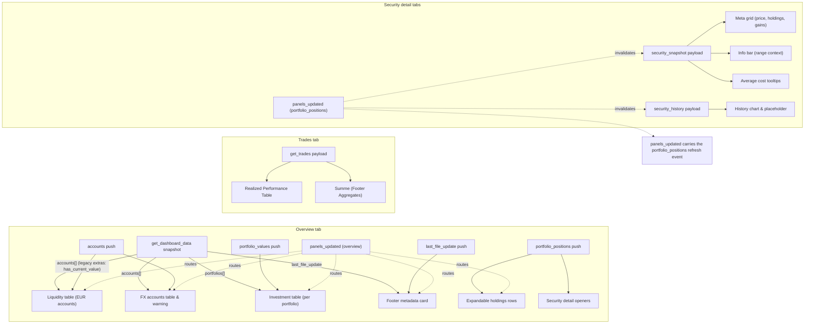

# Portfolio Performance Reader – Frontend Data Flow

This document details how the Home Assistant dashboard renders backend payloads across all frontend tabs, including the Overview, Trades (Realized Performance), and Security Detail views.

## Overview tab surfaces

| UI surface | Consumed data | Key fields | Notes |
| --- | --- | --- | --- |
| Header card ("Übersicht") | `accounts[]` + `portfolio_values[]` push payloads (snapshot mirrors the same fields) | Accounts contribute `name`, `currency_code`, `balance`, `orig_balance`, `(fx_unavailable)`; portfolio entries supply `current_value`, `purchase_sum`, `position_count`, `missing_value_positions`, and `performance.*` (`gain_abs`, `gain_pct`, `total_change_eur`, `total_change_pct`, `source`, `coverage_ratio`). | `renderDashboard` totals the EUR balances and portfolio aggregates that arrive via push events; first paint still depends on `fetchDashboardDataWS`. |
| Investment table | `portfolio_values.portfolios[]` push payload (snapshot keeps identical keys) | `uuid`, `name`, `current_value`, `purchase_sum`, `position_count`, `missing_value_positions`, and `performance.*`. | Portfolio aggregates are normalised into expandable table rows, with valuation and performance copied directly from the push payload. |
| Expandable holdings rows | `portfolio_positions` push payload | `positions[].security_uuid`, `aggregation.*`, `performance.*`, `average_cost.*` | When a depot expands, the tab fetches positions and wires security-detail launchers. |
| Liquidity table (EUR accounts) | `accounts[]` push payload | `name`, `currency_code`, `balance` | The renderer splits EUR accounts, renders balances in EUR, and contributes to the total wealth sum. |
| FX accounts table | `accounts[]` push payload | `name`, `currency_code`, `orig_balance`, `balance`, `(fx_unavailable)` | Non-EUR accounts render a two-column table with native and EUR balances. |
| Footer metadata card | `last_file_update` push payload | ISO 8601 timestamp string | The footer pulls the latest import timestamp. |
| Live updates queue | `panels_updated` | `data_type`, `data`, `portfolio_uuid` | `dashboard.ts` routes websocket events into update handlers that refresh the DOM sections without a full re-render. |

## Trades tab surfaces

| UI surface | Consumed data | Key fields | Notes |
| --- | --- | --- | --- |
| Realized Performance Table | `get_trades` payload (`trades[]`) | `name`, `last_sell_date`, `purchase_value_gross`, `sales_value_net`, `result_abs`, `result_pct`, `since_sell_abs` | Displays closed positions with aggregated realized gains/losses and "missed" gains (since sell). Uses stacked columns for compact display. |
| Footer (Sum Row) | `get_trades` payload (aggregated) | Sums of `purchase_value_gross`, `sales_value_net`, `result_abs`, `since_sell_abs` | Client-side aggregation of the trades table data to show column totals. |

## Security detail tabs

| UI surface | Consumed data | Key fields | Notes |
| --- | --- | --- | --- |
| Header card & meta grid | `security_snapshot` | `snapshot.name`, `market_value_eur`, `total_holdings`, `performance.*`, `average_cost.*`, `last_price_*` | `renderSecurityDetail` fetches the snapshot and renders an expanded meta grid with holdings, gains, and average cost tooltips. |
| Info bar & range controls | `security_snapshot`, `security_history` | `performance.day_change.*`, `currency_code`, `prices[]` | Range buttons refetch history windows on demand. |
| History chart placeholder | `security_history` | `prices[].date`, `prices[].close_native`, `prices[].close_eur` | The placeholder swaps to a rendered line chart once the requested range loads. |
| Cached snapshot notice | `security_snapshot` | `snapshot.source`, cached snapshot state | Explains whether the view is stale or sourced from cache-only data. |
| Live update invalidation | `portfolio_positions` via `panels_updated` | `securityUuids[]` | Security detail tabs subscribe to backend updates to invalidate cached snapshots when data changes. |

## Shared behaviours

| Behaviour | Consumed data | Notes |
| --- | --- | --- |
| Initial data fetch | Websocket commands per payload group | The overview tab issues `fetchDashboardDataWS`; Trades tab issues `fetchTradesWS`; detail views call dedicated helpers. |
| Lazy loading & caching | `portfolio_positions`, `security_snapshot`, `security_history` | Expandable portfolios and security tabs cache data locally. |
| Range selection | `security_history` | Range buttons call `fetchSecurityHistoryWS` with pre-defined windows. |
