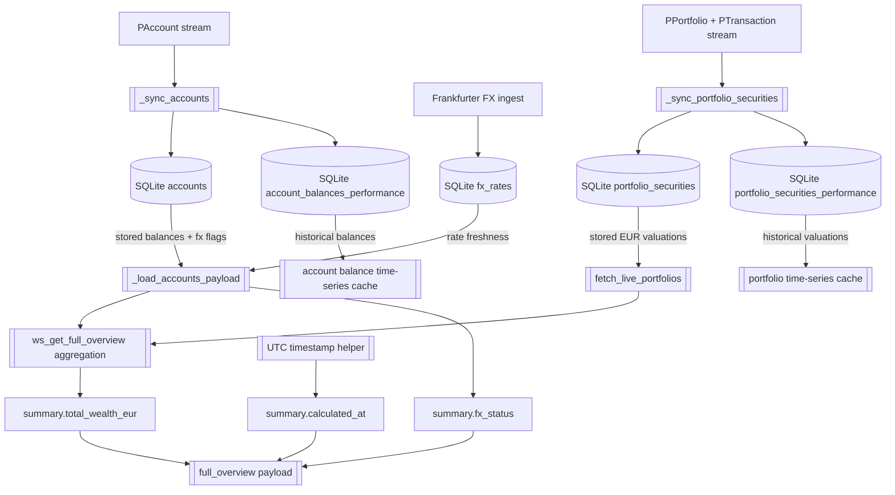
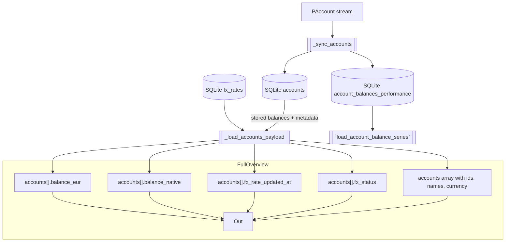
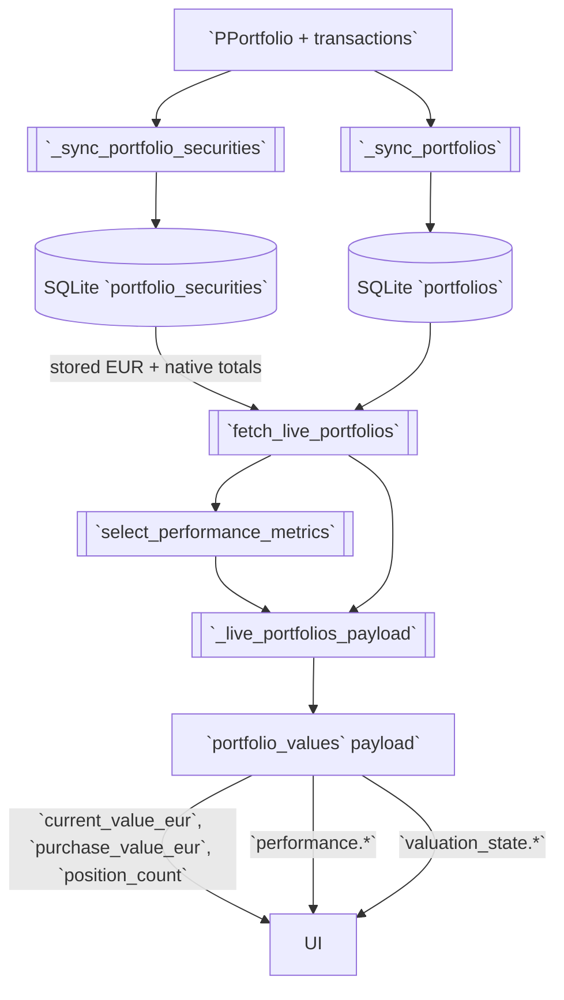
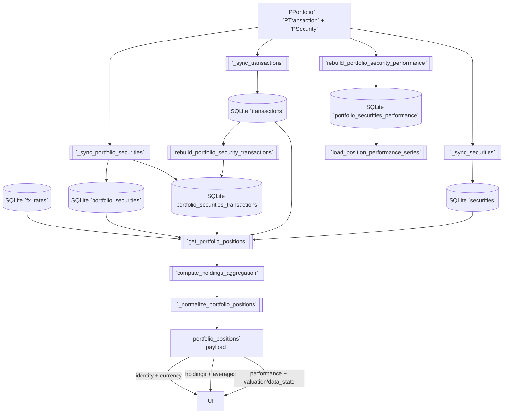
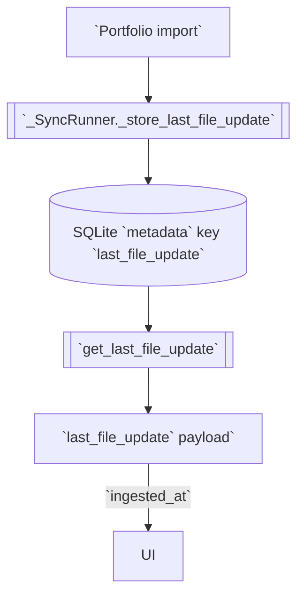
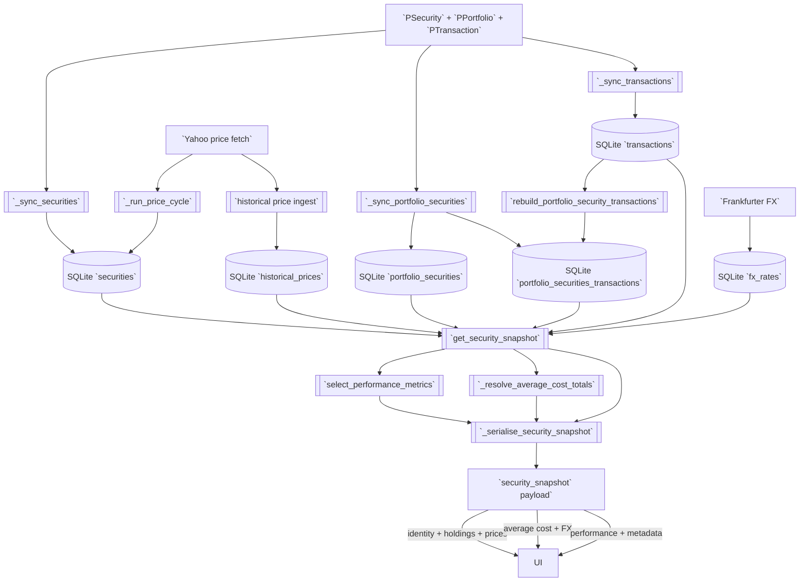
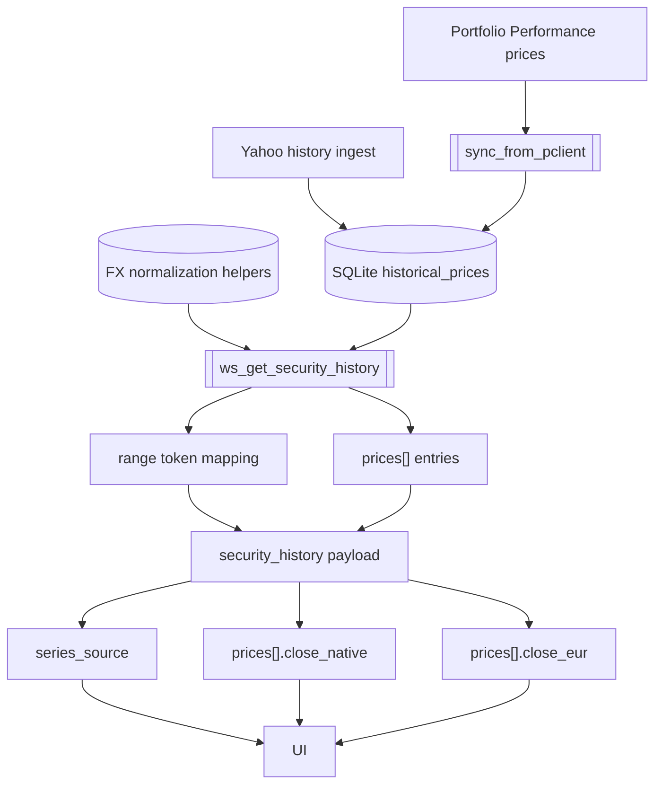
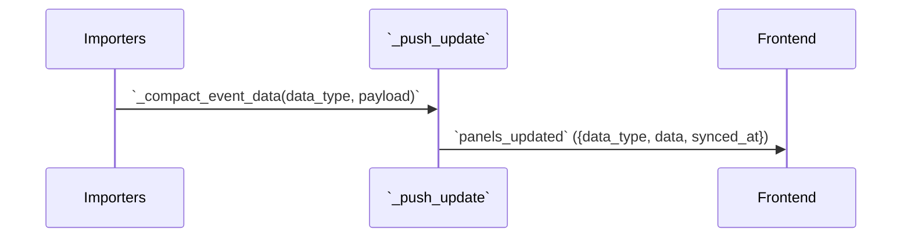

# Portfolio Performance Reader – Future Data Model Visualizations

### Full overview snapshot (`pp_reader/get_full_overview` command; push updates: `accounts`, `portfolio_values`, `last_file_update`)

**Scope**
- Provides the pre-aggregated wealth headline so the dashboard can render totals without client recomputation.
- Conveys FX coverage for banner logic, requiring fast inspection of account-level FX status.
- Guarantees a fresh `summary.calculated_at` stamp per payload emission for downstream caching.

**Mermaid visualization**

**Data contract table**
| Field / Subgroup | Source category | Notes / follow-up |
| --- | --- | --- |
| Summary totals (`summary.total_wealth_eur`) | 6 – Calculate it from database values in a function or method and hand it over directly to the front end. | Aggregate the persisted `accounts.balance` cents and `portfolio_securities.current_value_eur` totals loaded via `_load_accounts_payload` and `fetch_live_portfolios` before responding. |
| FX coverage (`summary.fx_status`) | 6 – Calculate it from database values in a function or method and hand it over directly to the front end. | Derive status from the stored FX availability flags returned by `_load_accounts_payload` when consolidating the websocket payload. |
| Metadata (`summary.calculated_at`) | 6 – Calculate it from database values in a function or method and hand it over directly to the front end. | Stamp the payload with `datetime.now()` (UTC) during websocket assembly; no SQLite persistence required. |
| Historical valuation cache | 4 – Calculate and stored inside the database. | `portfolio_securities_performance` holds daily valuation snapshots so dashboard trend widgets can pull precomputed data. |
| Account balance history cache | 4 – Calculate and stored inside the database. | `account_balances_performance` stores daily native and EUR balances so cash trend charts can load without recomputing transactions. |

**Implementation cues**
- Extend `custom_components/pp_reader/data/websocket.py::ws_get_full_overview` to consolidate `_load_accounts_payload` and `fetch_live_portfolios` outputs, emit the enum-mapped FX status, and stamp `datetime.now(tz=UTC)`.
- Ensure `custom_components/pp_reader/data/db_access.py::fetch_live_portfolios` continues supplying EUR totals so aggregation avoids per-request recomputation.
- Cache the composed summary within the websocket request scope only; no long-lived cache is required because the payload depends on current FX and holdings state.

### Account summaries (slice of `pp_reader/get_full_overview` command, `accounts` push)

**Scope**
- Delivers the canonical list of accounts for liquidity tables, preserving proto ordering and identifiers.
- Supplies pre-converted EUR balances so overview totals can recompute instantly on the client.
- Surfaces FX metadata for tooltip coverage with minimal websocket latency.

**Mermaid visualization**

**Data contract table**
| Field / Subgroup | Source category | Notes / follow-up |
| --- | --- | --- |
| Account identity (`accounts`, `accounts[].account_id`, `accounts[].name`, `accounts[].currency_code`) | 1 – Passed from portfolio file and stored in database. | No outstanding follow-ups; ensure proto ordering is preserved. |
| Balances (`accounts[].balance_native`, `accounts[].balance_eur`) | `balance_native`: 4 – Calculate and stored inside the database. `balance_eur`: 6 – Calculate it from database values in a function or method and hand it over directly to the front end. | `_sync_accounts` persists the native-currency balance in `accounts.balance`; `_load_accounts_payload` converts that stored value to EUR with the latest FX rate before emitting the websocket payload. |
| FX metadata (`accounts[].fx_rate_updated_at`, `accounts[].fx_status`) | `fx_rate_updated_at`: 3 – Frankfurt, APIFX fetch store and database. `fx_status`: 6 – Calculate it from database values in a function or method and hand it over directly to the front end. | `fx_rate_updated_at`: `_load_accounts_payload` exposes the persisted Frankfurter timestamp sourced from `fx_rates`. `fx_status`: Map the stored FX availability flags into the documented enum before responding. |
| Historical balance series | 4 – Calculate and stored inside the database. | `account_balances_performance` supplies daily balances so the frontend can render account trend charts without replaying transactions. |

**Implementation cues**
- Keep `custom_components/pp_reader/data/db_access.py::get_accounts` and `_load_accounts_payload` responsible for joining `fx_rates` so websocket calls avoid per-row FX lookups.
- Update `custom_components/pp_reader/data/websocket.py::_load_accounts_payload` to emit the enum status and expose the stored Frankfurter timestamp.
- When aligning `accounts[].balance_native`, audit `db_calc_account_balance` to ensure the stored cent totals match the documented data source path.

### Portfolio summaries (slice of `pp_reader/get_full_overview` command, `portfolio_values` push)

**Scope**
- Provides pre-aggregated portfolio metrics for the overview table without requiring client aggregation.
- Propagates performance calculations that depend on holdings, purchase totals, and FX normalization.
- Exposes valuation health so the UI can warn about missing data before drill-down.

**Mermaid visualization**

**Data contract table**
| Field / Subgroup | Source category | Notes / follow-up |
| --- | --- | --- |
| Portfolio identity (`portfolios`, `portfolios[].portfolio_id`, `portfolios[].name`) | 1 – Passed from portfolio file and stored in database. | No outstanding follow-ups; ensure ordering preserved. |
| Aggregated holdings (`portfolios[].position_count`, `portfolios[].purchase_value_eur`, `portfolios[].current_value_eur`) | `position_count`: 6 – Calculate it from database values in a function or method and hand it over directly to the front end. `purchase_value_eur`: 6 – Calculate it from database values in a function or method and hand it over directly to the front end. `current_value_eur`: 6 – Calculate it from database values in a function or method and hand it over directly to the front end. | Derive each metric by summing the persisted `portfolio_securities` totals (share rows and stored cent valuations) per portfolio before emitting the websocket payload. |
| Performance metrics (`portfolios[].performance.gain_eur`, `portfolios[].performance.gain_pct`) | 6 – Calculate it from database values in a function or method and hand it over directly to the front end. | No outstanding follow-ups; maintain linkage with `select_performance_metrics`. |
| Valuation state (`portfolios[].valuation_state.status`, `portfolios[].valuation_state.missing_positions`) | 6 – Calculate it from database values in a function or method and hand it over directly to the front end. | Follow-up: the portfolio query only exposes `missing_value_positions`/`has_current_value`, so we still need to map those flags into the documented enum before the websocket responds. |

**Implementation cues**
- Extend `custom_components/pp_reader/data/websocket.py::_live_portfolios_payload` to translate `has_current_value`/`missing_value_positions` into the `valuation_state.status` enum and forward `missing_positions` verbatim.
- Ensure `custom_components/pp_reader/data/db_access.py::fetch_live_portfolios` continues returning cent-level aggregates for efficient conversion.
- Keep `custom_components/pp_reader/data/performance.py::select_performance_metrics` as the single performance calculator to avoid duplicated gain logic in the websocket layer.

### Portfolio positions (`pp_reader/get_portfolio_positions` command, `portfolio_positions` push)

**Scope**
- Supplies the per-portfolio holdings table with precomputed valuations, performance, and FX-aware averages.
- Preserves proto identifiers to support stable diffing across live updates.
- Surfaces valuation and data-state flags so row-level warnings can be rendered immediately.

**Mermaid visualization**

**Data contract table**
| Field / Subgroup | Source category | Notes / follow-up |
| --- | --- | --- |
| Container & routing (`portfolio_id`, `positions`) | `portfolio_id`: 1 – Passed from portfolio file and stored in database. `positions`: 4 – Calculate and stored inside the database. | The `positions` array enumerates persisted `portfolio_securities` rows in the order returned by `get_portfolio_positions` for websocket diffing. |
| Position identity (`positions[].position_id`, `positions[].portfolio_id`, `positions[].security_id`, `positions[].name`, `positions[].security_currency_code`) | `positions[].portfolio_id`, `positions[].security_id`, `positions[].name`, `positions[].security_currency_code`: 1 – Passed from portfolio file and stored in database. `positions[].position_id`: 4 – Calculate and stored inside the database. | Follow-up: `get_portfolio_positions` still emits rows keyed by `security_uuid` without generating a separate `position_id`, so we need a follow-up to persist and expose a dedicated identifier. The stored `securities.security_currency` column should be joined into the payload to expose each security’s native currency. |
| Holdings & valuations (`positions[].quantity`, `positions[].current_value_eur`, `positions[].purchase_value_eur`) | `positions[].quantity`: 4 – Calculate and stored inside the database. `positions[].current_value_eur`: 4 – Calculate and stored inside the database. `positions[].purchase_value_eur`: 4 – Calculate and stored inside the database. | `portfolio_securities.share_count`, `current_value_eur`, and `purchase_value_eur` persist the post-aggregation holdings so the websocket layer can forward them without recomputing. |
| Average cost & FX (`positions[].average_cost.*`, `positions[].average_cost.fx_rate_timestamp`) | `average_cost.primary.value`: 4 – Calculate and stored inside the database. `average_cost.primary.currency`: 1 – Passed from portfolio file and stored in database. `average_cost.secondary.value`: 4 – Calculate and stored inside the database. `average_cost.secondary.currency`: 6 – Calculate it from database values in a function or method and hand it over directly to the front end. `average_cost.fx_rate_timestamp`: 3 – Frankfurt, APIFX fetch store and database. | `portfolio_securities.avg_price_native` and `avg_price_eur` persist the native and EUR share prices; ensure the websocket formatter tags the EUR slot explicitly and forwards the saved FX timestamp sourced from `fx_rates`. |
| Performance & state (`positions[].performance.gain_eur`, `positions[].performance.gain_pct`, `positions[].valuation_state.*`, `positions[].data_state.*`) | 6 – Calculate it from database values in a function or method and hand it over directly to the front end. | Use the persisted holdings, rollups rebuilt from the canonical `transactions` table, and Frankfurter/Yahoo context to derive valuation enums before responding. Follow-up: the normalization layer still needs to translate loader errors into the documented `data_state.*` fields and attach valuation reasons per row. |
| Day change metrics (`positions[].performance.day_change.value_native`, `positions[].performance.day_change.value_eur`) | 4 – Calculate and stored inside the database. | Join `securities.day_change_native` and `securities.day_change_eur` so the positions table shares the same persisted deltas as the security snapshot, avoiding per-request recomputation. |
| Historical valuation series | 4 – Calculate and stored inside the database. | `portfolio_securities_performance` persists daily native and EUR valuations so the frontend can chart position history without recomputing. |

**Implementation cues**
- Extend `custom_components/pp_reader/data/db_access.py::get_portfolio_positions` to persist `position_id`, expose the security currency code, and surface FX timestamps pulled from `fx_rates` joins.
- Join `securities.day_change_*` inside `custom_components/pp_reader/data/db_access.py::get_portfolio_positions` so the websocket payload can forward the stored day-change deltas without recalculating them.
- Update `custom_components/pp_reader/data/websocket.py::_normalize_portfolio_positions` to translate loader errors into `data_state.*` and attach valuation enums and reasons.
- Keep `custom_components/pp_reader/data/aggregations.py::compute_holdings_aggregation` as the central place for cent-to-EUR conversions to avoid duplicate rounding logic.

### Last file update (slice of `pp_reader/get_full_overview` command, `last_file_update` push)

**Scope**
- Communicates when the backend last processed a portfolio import for footer messaging.
- Offers a lightweight heartbeat payload that can be polled or pushed without heavy computation.

**Mermaid visualization**

**Data contract table**
| Field / Subgroup | Source category | Notes / follow-up |
| --- | --- | --- |
| Timestamps (`last_file_update.ingested_at`) | 4 – Calculate and stored inside the database. | No outstanding follow-ups; ensure truncated ISO persists. |

**Implementation cues**
- Ensure `custom_components/pp_reader/data/db_access.py::get_last_file_update` continues to return the persisted timestamp verbatim for the websocket payload.

### Security snapshot (`pp_reader/get_security_snapshot` command, `security_snapshot` push)

**Scope**
- Aggregates holdings, pricing, performance, and FX context for a single security in one payload.
- Enables drill-down views to render without additional API calls by including purchase totals and metadata.
- Must reconcile live market inputs (Yahoo) with stored portfolio data consistently across refreshes.

**Mermaid visualization**

**Data contract table**
| Field / Subgroup | Source category | Notes / follow-up |
| --- | --- | --- |
| Identity & currencies (`security_id`, `name`, `currency_code`, `account_currency_code`) | 1 – Passed from portfolio file and stored in database. | No outstanding follow-ups; ensure routing uses stored UUIDs. |
| Snapshot metadata (`snapshot_timestamp`, `data_source`, `last_transaction_at`) | `snapshot_timestamp`: 4 – Calculate and stored inside the database. `data_source`: 6 – Calculate it from database values in a function or method and hand it over directly to the front end. `last_transaction_at`: 4 – Calculate and stored inside the database. | `snapshot_timestamp`: persist the snapshot instant (for example by mirroring `metadata.last_file_update`) so the payload can expose it. `data_source`: classify the payload based on whether the stored price originated from Yahoo live data or historical files before sending. `last_transaction_at`: surface the most recent `portfolio_securities_transactions.transaction_date` captured for the requested security. |
| Holdings & valuation (`holdings.total_units`, `holdings.precise_units`, `market_value_eur`, `purchase_value_eur`) | `holdings.total_units`: 6 – Calculate it from database values in a function or method and hand it over directly to the front end. `holdings.precise_units`: 4 – Calculate and stored inside the database. `market_value_eur`: 4 – Calculate and stored inside the database. `purchase_value_eur`: 4 – Calculate and stored inside the database. | `portfolio_securities.share_count` stores the precise units; expose that value directly and derive `total_units` from it for display. Persisted `current_value_eur`/`purchase_value_eur` remove the need for per-request recomputation. |
| Pricing (`last_price.native_value`, `last_price.account_value`, `last_price.market_time`, `last_price.fetched_at`) | `native_value`: 2 – Yahoo query life fetch store in database. `account_value`: 6 – Calculate it from database values in a function or method and hand it over directly to the front end. `market_time`: 2 – Yahoo query life fetch store in database. `fetched_at`: 2 – Yahoo query life fetch store in database. | Convert the persisted native quote to account currency on demand, forward the stored `securities.last_price_time` so the UI can annotate the price with its market timestamp, and include `securities.last_price_fetched_at` for the detail footer freshness row. |
| Average cost (`average_cost.primary.*`, `average_cost.secondary.*`, `average_cost.fx_rate_timestamp`) | `primary.value`: 4 – Calculate and stored inside the database. `primary.currency`: 1 – Passed from portfolio file and stored in database. `secondary.value`: 4 – Calculate and stored inside the database. `secondary.currency`: 6 – Calculate it from database values in a function or method and hand it over directly to the front end. `fx_rate_timestamp`: 3 – Frankfurt, APIFX fetch store and database. | `portfolio_securities.avg_price_native` and `avg_price_eur` now persist the calculated costs; ensure the serializer tags the EUR slot explicitly and forwards the FX timestamp sourced from `fx_rates`. |
| Performance (`performance.total.*`, `performance.day_change.*`) | `performance.total.*`: 6 – Calculate it from database values in a function or method and hand it over directly to the front end. `performance.day_change.value_native`: 4 – Calculate and stored inside the database. `performance.day_change.value_eur`: 4 – Calculate and stored inside the database. `performance.day_change.pct`, `performance.day_change.coverage_ratio`, `performance.day_change.source`: 6 – Calculate it from database values in a function or method and hand it over directly to the front end. | Price updates persist `securities.day_change_native` by comparing the stored quote with the latest `historical_prices.close`, and persist `securities.day_change_eur` by applying the freshest Frankfurter FX rate. The serializer reuses those columns so positions and the detail view share identical day-change deltas. |
| Purchase context (`purchase_totals.*`, `purchase_fx.*`) | `purchase_totals.security_currency`: 4 – Calculate and stored inside the database. `purchase_totals.account_currency`: 4 – Calculate and stored inside the database. `purchase_fx.*`: 3 – Frankfurt, APIFX fetch store and database. | `portfolio_securities.purchase_value_native` and `purchase_value_eur` persist the aggregated purchase totals, while `portfolio_securities_transactions` (rebuilt from canonical `transactions`) plus Frankfurter rates surface the FX metadata required for the payload. |

**Implementation cues**
- Expand `custom_components/pp_reader/data/db_access.py::get_security_snapshot` to load transaction-derived timestamps, Frankfurter rate metadata, day-change deltas from `securities.day_change_*`, and Yahoo history prerequisites before serialization.
- Update `custom_components/pp_reader/data/websocket.py::_serialise_security_snapshot` to rename existing EUR price outputs to the documented keys, attach the `data_source` classification, and surface `last_price.market_time` / `last_price.fetched_at` in their new UI slots.
- Ensure `custom_components/pp_reader/prices/price_service.py::_run_price_cycle` (or associated helpers) persists `securities.day_change_*` by comparing the stored quote with the latest `historical_prices.close` and applying the freshest Frankfurter FX rate so both the snapshot and portfolio positions share the same deltas.

### Security history (`pp_reader/get_security_history` command, `security_history` push)

**Scope**
- Streams chart-ready price series for each security across selectable ranges.
- Distinguishes between Portfolio Performance and market data to label the chart legend accurately.
- Ensures EUR overlays are delivered alongside native closes for consistent tooltip behaviour.

**Mermaid visualization**

**Data contract table**
| Field / Subgroup | Source category | Notes / follow-up |
| --- | --- | --- |
| Identity & selection (`security_id`, `range`) | `security_id`: 1 – Passed from portfolio file and stored in database. `range`: 6 – Calculate it from database values in a function or method and hand it over directly to the front end. | `range`: translate websocket parameters into canonical tokens before responding. |
| Series metadata (`series_source`) | 6 – Calculate it from database values in a function or method and hand it over directly to the front end. | Portfolio imports write prices without tagging the origin, so once the Yahoo history ingest lands we must persist a source flag and map it to `portfolio_performance` vs `market_data`. |
| Price points (`prices`, `prices[].date`, `prices[].close_native`, `prices[].close_eur`) | `prices`, `prices[].date`, `prices[].close_native`: 2 – Yahoo query life fetch store in database. `prices[].close_eur`: 6 – Calculate it from database values in a function or method and hand it over directly to the front end. | Follow-ups: Yahoo pipeline must parse ISO datestamps, map `close` into `historical_prices.close`, and extend the history handler to call `normalize_price_to_eur_sync` per row before emitting EUR values. |

**Implementation cues**
- Add Yahoo history persistence in `custom_components/pp_reader/prices/price_service.py` so `historical_prices` holds both origin and close data for requested ranges.
- Update `custom_components/pp_reader/data/websocket.py::ws_get_security_history` to translate `start_date`/`end_date` parameters into canonical range tokens and attach EUR conversions.
- Ensure `custom_components/pp_reader/util/currency.py::normalize_price_to_eur_sync` can be reused efficiently for per-point conversions without redundant rate lookups.

### Live update envelope (`panels_updated` bus)

**Scope**
- Carries push notifications that instruct the frontend which handler should process the payload.
- Wraps underlying data model sections without altering their structure.
- Provides optional timestamps for debugging event freshness once implemented.

**Mermaid visualization**

**Data contract table**
| Field / Subgroup | Source category | Notes / follow-up |
| --- | --- | --- |
| Discriminator (`data_type`) | 6 – Calculate it from database values in a function or method and hand it over directly to the front end. | No follow-up; values already align with canonical literals. |
| Payload passthrough (`payload`) | 6 – Calculate it from database values in a function or method and hand it over directly to the front end. | `_compact_event_data` only removes redundant keys before `_push_update` nests the structure under `data`. |
| Emission timestamp (`synced_at`) | 6 – Calculate it from database values in a function or method and hand it over directly to the front end. | Follow-up: `_push_update` currently emits only `domain`, `entry_id`, `data_type`, and `data`, so we still need to add a timestamp (for example `dt_util.utcnow().isoformat()`) before the frontend can display `synced_at`. |

**Implementation cues**
- Extend `custom_components/pp_reader/data/event_push.py::_push_update` to append a UTC timestamp and ensure the structure remains `{"data_type", "data", "synced_at"}`.
- Keep `_compact_event_data` focused on removing redundant keys so downstream payloads remain identical to their source API responses.
- Audit all producers (`sync_from_pclient`, `price_service`) to confirm they pass canonical `data_type` strings that align with the documented enum.
