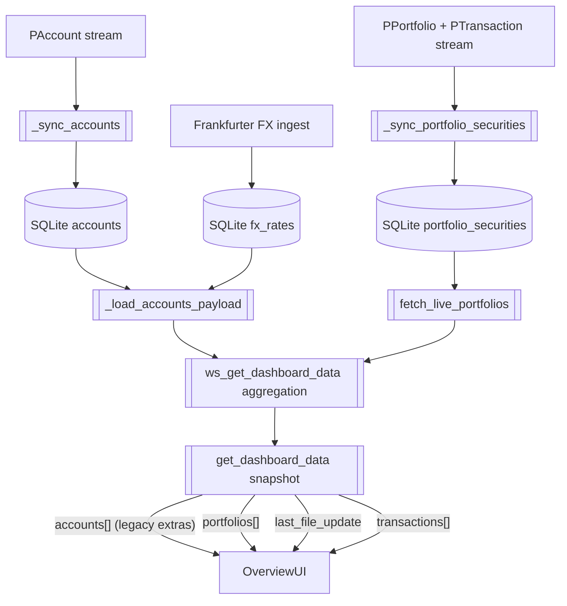
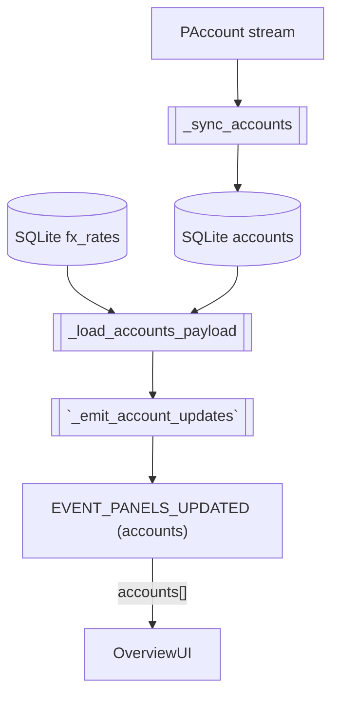
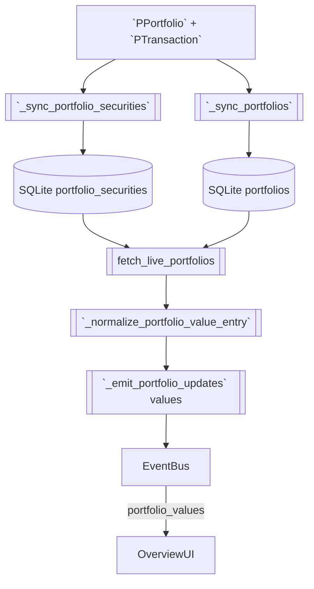
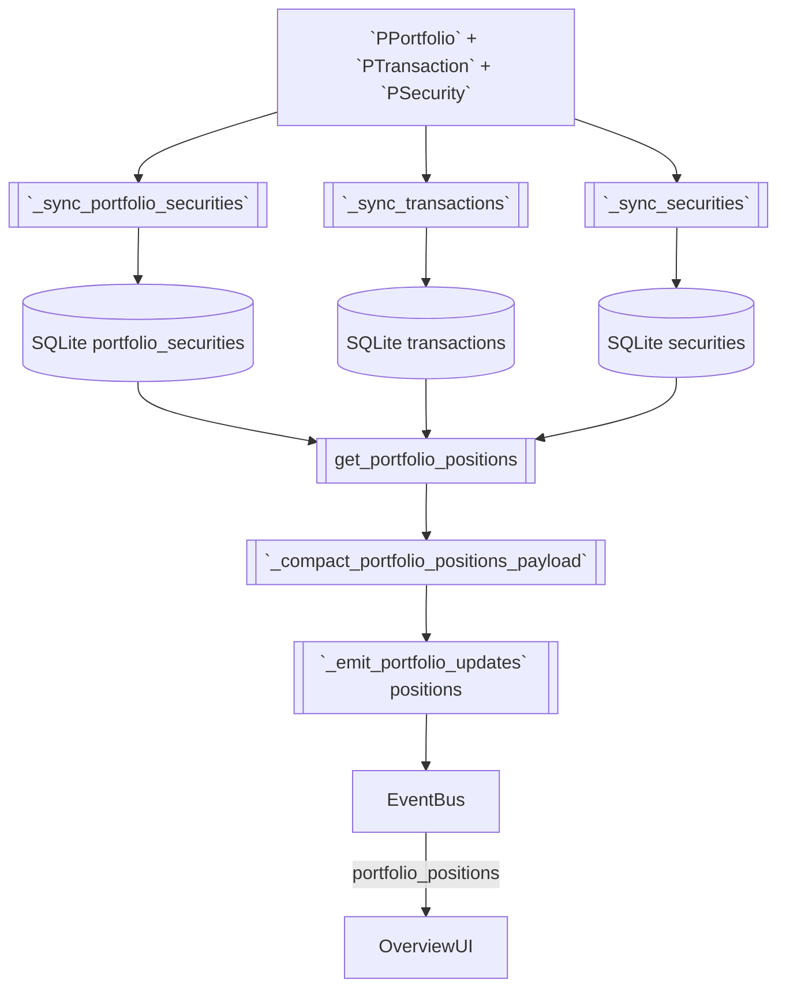

# Portfolio Performance Reader – Data Model Visualizations

### Dashboard snapshot (`pp_reader/get_dashboard_data`; harmonised push updates: `accounts`, `portfolio_values`, `portfolio_positions`, `last_file_update`)

**Scope**
- Bootstraps the overview tab with the same structures used by the push events.
- Continues to expose legacy extras (`has_current_value`, cached `transactions[]`) until the websocket handler is trimmed.
- Provides a baseline so the UI can render before the first `panels_updated` event lands.

**Mermaid visualization**

**Data contract table**
| Field / Subgroup | Source category | Notes / follow-up |
| --- | --- | --- |
| `accounts[]` | 6 – Calculate it from database values in a function or method and hand it over directly to the front end. | Mirrors the canonical `accounts` push payload including the optional `fx_unavailable` flag. |
| `portfolios[]` | 6 – Calculate it from database values in a function or method and hand it over directly to the front end. | Mirrors `portfolio_values`; still carries `has_current_value` until the backend trims it. |
| `last_file_update` | 4 – Calculate and stored inside the database. | Reuses the formatted timestamp emitted by the push event. |
| `transactions[]` | 1 – Passed from portfolio file and stored in database. | Snapshot-only helper for the cached transactions table; not part of the harmonised push set. |

**Implementation cues**
- Leave `ws_get_dashboard_data` unchanged for now; downstream docs treat the push events as canonical.
- Once the backend trims snapshot extras, remove the note above and align the diagrams accordingly.

### Account summaries (`accounts` push)

**Scope**
- Supplies the liquidity tables with ordered account listings.
- Delivers native and EUR balances so totals can be recomputed instantly.
- Flags missing FX data without requiring additional websocket lookups.

**Mermaid visualization**

**Data contract table**
| Field / Subgroup | Source category | Notes / follow-up |
| --- | --- | --- |
| Identity (`accounts`, `accounts[].name`, `accounts[].currency_code`) | 1 – Passed from portfolio file and stored in database. | Ordering and labels originate from Portfolio Performance; `_sync_accounts` persists them for reuse. |
| Native balance (`accounts[].orig_balance`) | 6 – Calculate it from database values in a function or method and hand it over directly to the front end. | `_load_accounts_payload` converts stored cent totals to floats so native balances render without recomputation. |
| EUR balance (`accounts[].balance`) | 6 – Calculate it from database values in a function or method and hand it over directly to the front end. | Loader divides the native balance by the latest Frankfurter rate and rounds it before emission. |
| FX availability (`accounts[].fx_unavailable`) | 6 – Calculate it from database values in a function or method and hand it over directly to the front end. | Flag is only attached when no conversion rate is available for the account currency. |

**Implementation cues**
- Ensure `_load_accounts_payload` continues to fetch FX rates once per snapshot to avoid per-row lookups.
- Push helper must forward the dictionaries unchanged so the documented fields remain authoritative.

### Portfolio summaries (`portfolio_values` push)

**Scope**
- Provides pre-aggregated portfolio metrics for the overview table.
- Surfaces performance metrics computed from stored holdings and purchase totals.
- Flags incomplete valuations when holdings lack current values.

**Mermaid visualization**

**Data contract table**
| Field / Subgroup | Source category | Notes / follow-up |
| --- | --- | --- |
| Identity (`portfolios`, `portfolios[].uuid`, `portfolios[].name`) | 1 – Passed from portfolio file and stored in database. | Proto ordering is preserved to keep table rows stable. |
| Aggregates (`portfolios[].position_count`, `portfolios[].current_value`, `portfolios[].purchase_sum`) | 6 – Calculate it from database values in a function or method and hand it over directly to the front end. | `fetch_live_portfolios` sums the stored holdings and converts cents to EUR before emission. |
| Valuation health (`portfolios[].missing_value_positions`) | 6 – Calculate it from database values in a function or method and hand it over directly to the front end. | Count of holdings with missing current values travels unchanged through the push compactor. |
| Performance (`portfolios[].performance.*`) | 6 – Calculate it from database values in a function or method and hand it over directly to the front end. | `select_performance_metrics` computes `gain_abs`, `gain_pct`, `total_change_eur`, `total_change_pct`, `source`, and `coverage_ratio` for each portfolio. |

**Implementation cues**
- Keep `_compact_portfolio_values_payload` in sync with any future additions to the performance dataclass.
- Documented payload no longer advertises valuation status enums; the push event exposes the raw counts consumed by the UI.

### Portfolio positions (`portfolio_positions` push)

**Scope**
- Streams per-portfolio position details when the overview accordion expands.
- Provides precomputed EUR valuations, purchase aggregates, and average-cost metadata.
- Shares consistent performance metrics for reuse across overview and security detail tabs.

**Mermaid visualization**

**Data contract table**
| Field / Subgroup | Source category | Notes / follow-up |
| --- | --- | --- |
| Envelope (`portfolio_uuid`, `positions[]`, `error?`) | 6 – Calculate it from database values in a function or method and hand it over directly to the front end. | Each push message targets one portfolio and may include an `error` string when loading failed. |
| Position identity (`positions[].security_uuid`, `positions[].name`) | 1 – Passed from portfolio file and stored in database. | UUIDs tie rows back to cached security data; names render verbatim. |
| Holdings & valuations (`positions[].current_holdings`, `positions[].purchase_value`, `positions[].current_value`) | 6 – Calculate it from database values in a function or method and hand it over directly to the front end. | `get_portfolio_positions` aggregates stored cent values and rounds them before serialising. |
| Average cost (`positions[].average_cost.*`) | 6 – Calculate it from database values in a function or method and hand it over directly to the front end. | Dataclass exposes `native`, `security`, `account`, `eur`, `source`, and `coverage_ratio`; push formatter forwards the mapping unchanged. |
| Aggregation metadata (`positions[].aggregation.*`) | 6 – Calculate it from database values in a function or method and hand it over directly to the front end. | Contains totals for holdings, purchase value (cents & EUR), and currency totals needed for tooltips. |
| Performance (`positions[].performance.*`) | 6 – Calculate it from database values in a function or method and hand it over directly to the front end. | Shares the same `PerformanceMetrics` structure as portfolios (`gain_abs`, `gain_pct`, `total_change_eur`, `total_change_pct`, `source`, `coverage_ratio`). |

**Implementation cues**
- `_compact_portfolio_positions_payload` must remain lossless for the documented keys so downstream consumers receive consistent structures.
- Day-change metrics are not part of the push payload; retain that logic in the security snapshot path only.
