# Consolidated Backend-to-UI Data Flow

The diagram below combines the previously separate backend flowcharts into a single view with the Portfolio Performance UI at the center. Each surrounding cluster represents a websocket payload or bus event that delivers data to the dashboard.

```mermaid
---
id: 3352fa75-eea8-43f1-acf3-9faffdbd6a55
---
flowchart TB
  UI[[Portfolio Performance UI]]

  subgraph DashboardSnapshot["Dashboard snapshot (get_dashboard_data)"]
    AccountsProto[["PAccount stream"]] --> SyncAccounts[["_sync_accounts"]]
    SyncAccounts --> AccountsDB[("SQLite accounts")]
    SyncAccounts --> AccountPerfDB[("SQLite account_balances_performance")]
    FXProto[["Frankfurter FX ingest"]] --> FxRates[("SQLite fx_rates")]
    HoldingsProto[["PPortfolio + PTransaction stream"]] --> SyncHoldings[["_sync_portfolio_securities"]]
    SyncHoldings --> PortfolioSecDB[("SQLite portfolio_securities")]
    SyncHoldings --> PortfolioPerfDB[("SQLite portfolio_securities_performance")]
    AccountsDB --> LoadAccounts[["_load_accounts_payload"]]
    FxRates --> LoadAccounts
    PortfolioSecDB --> FetchLivePortfolios[["fetch_live_portfolios"]]
    LoadAccounts --> SnapshotAgg[["ws_get_dashboard_data aggregation"]]
    FetchLivePortfolios --> SnapshotAgg
    SnapshotAgg --> DashboardPayload[["get_dashboard_data snapshot (legacy)"]]
    Clock[["UTC timestamp helper"]] --> DashboardPayload
    PortfolioPerfDB --> PortfolioHistoryCache[["portfolio time-series cache"]]
    AccountPerfDB --> AccountHistoryCache[["account balance time-series cache"]]
  end
  DashboardPayload --> UI
  PortfolioHistoryCache --> UI
  AccountHistoryCache --> UI

  subgraph AccountSummaries["accounts push"]
    AccountsProto --> SyncAccounts
    AccountsDB --> LoadAccountsPayload[["_load_accounts_payload"]]
    FxRates --> LoadAccountsPayload
    LoadAccountsPayload --> AccountsPayload[["accounts push payload"]]
    AccountPerfDB --> AccountTrendQuery[["load_account_balance_series"]]
  end
  AccountsPayload --> UI
  AccountTrendQuery --> UI

  subgraph PortfolioSummaries["portfolio_values push"]
    PortfolioProto[["PPortfolio + transactions"]] --> SyncPortfolios[["_sync_portfolios"]]
    PortfolioProto --> SyncHoldings
    SyncPortfolios --> PortfoliosDB[("SQLite portfolios")]
    PortfoliosDB --> LivePortfolios[["fetch_live_portfolios"]]
    PortfolioSecDB --> LivePortfolios
    LivePortfolios --> PerformanceMetrics[["select_performance_metrics"]]
    PerformanceMetrics --> PortfolioNormalize[["_live_portfolios_payload"]]
    LivePortfolios --> PortfolioNormalize
    PortfolioNormalize --> PortfolioValuesPayload[["portfolio_values push payload"]]
  end
  PortfolioValuesPayload --> UI

  subgraph PortfolioPositions["portfolio_positions push"]
    PositionProto[["PPortfolio + PTransaction + PSecurity"]] --> SyncTransactions[["_sync_transactions"]]
    PositionProto --> SyncPortSec[["_sync_portfolio_securities"]]
    PositionProto --> SyncPerf[["rebuild_portfolio_security_performance"]]
    PositionProto --> SyncSecurities[["_sync_securities"]]
    SyncTransactions --> TransactionsDB[("SQLite transactions")]
    SyncPortSec --> PortfolioSecDB
    SyncPortSec --> PositionTxAggDB[("SQLite portfolio_securities_transactions")]
    SyncPerf --> PortfolioPerfDB
    SyncSecurities --> SecuritiesDB[("SQLite securities")]
    TransactionsDB --> TxRollup[["rebuild_portfolio_security_transactions"]]
    TxRollup --> PositionTxAggDB
    FxRates --> GetPositions[["get_portfolio_positions"]]
    PortfolioSecDB --> GetPositions
    PositionTxAggDB --> GetPositions
    TransactionsDB --> GetPositions
    SecuritiesDB --> GetPositions
    GetPositions --> HoldingsAgg[["compute_holdings_aggregation"]]
    HoldingsAgg --> NormalizePositions[["_normalize_portfolio_positions"]]
    NormalizePositions --> PortfolioPositionsPayload[["portfolio_positions payload"]]
    PortfolioPerfDB --> PositionTrendSeries[["load_position_performance_series"]]
  end
  PortfolioPositionsPayload --> UI
  PositionTrendSeries --> UI

  subgraph LastFileUpdate["Last File Update"]
    ImportRun[["Portfolio import"]] --> StoreLastUpdate[["_SyncRunner._store_last_file_update"]]
    StoreLastUpdate --> MetadataDB[("SQLite metadata")]
    MetadataDB --> LastFileLoader[["get_last_file_update"]]
    LastFileLoader --> LastFilePayload[["last_file_update payload"]]
  end
  LastFilePayload --> UI

  subgraph SecuritySnapshot["Security Snapshot"]
    SecurityProto[["PSecurity + PPortfolio + PTransaction"]] --> SyncSecurities
    SecurityProto --> SyncPortSec
    SecurityProto --> SyncTransactions
    YahooFetch[["Yahoo price fetch"]] --> PriceCycle[["_run_price_cycle"]]
    PriceCycle --> SecuritiesDB
    Frankfurter[["Frankfurter FX"]] --> FxRates
    SecuritiesDB --> SecuritySnapshotLoader[["get_security_snapshot"]]
    PortfolioSecDB --> SecuritySnapshotLoader
    PositionTxAggDB --> SecuritySnapshotLoader
    TransactionsDB --> SecuritySnapshotLoader
    FxRates --> SecuritySnapshotLoader
    HistoricalPricesDB --> SecuritySnapshotLoader
    SecuritySnapshotLoader --> SnapshotPerf[["select_performance_metrics"]]
    SecuritySnapshotLoader --> SnapshotAvg[["_resolve_average_cost_totals"]]
    SnapshotPerf --> SnapshotSerial[["_serialise_security_snapshot"]]
    SnapshotAvg --> SnapshotSerial
    SecuritySnapshotLoader --> SnapshotSerial
    SnapshotSerial --> SecuritySnapshotPayload[["security_snapshot payload"]]
  end
  SecuritySnapshotPayload --> UI

  subgraph SecurityHistory["Security History"]
    PortfolioPrices[["Portfolio Performance prices"]] --> SyncHistory[["sync_from_pclient"]]
    SyncHistory --> HistoricalPricesDB[("SQLite historical_prices")]
    YahooHistory[["Yahoo history ingest"]] --> HistoricalPricesDB
    FxHelpers[["FX normalization helpers"]] --> SecurityHistoryHandler[["ws_get_security_history"]]
    HistoricalPricesDB --> SecurityHistoryHandler
    SecurityHistoryHandler --> RangeMapper[["range token mapping"]]
    SecurityHistoryHandler --> SeriesBuilder[["prices[] entries"]]
    RangeMapper --> SecurityHistoryPayload[["security_history payload"]]
    SeriesBuilder --> SecurityHistoryPayload
  end
  SecurityHistoryPayload --> UI

  subgraph LiveUpdate["Live Update Envelope"]
    Importers[["Importers"]] --> EventBus[["_push_update"]]
    EventBus --> PanelsUpdated[["panels_updated event"]]
  end
  PanelsUpdated --> UI
```



## Payload Highlights

| Payload / Event | Primary Purpose | Key Outputs delivered to the UI |
| --- | --- | --- |
| `get_dashboard_data` snapshot (legacy) | Bootstraps the overview tab on initial load using the same structures as the push payloads while still exposing pre-harmonisation extras. | `accounts[]`, `portfolios[]`, `last_file_update`, `transactions[]`; portfolio entries additionally include `has_current_value` until the backend aligns the handler. |
| `accounts` | Provides canonical account listings, balances, and FX availability flags. | Each entry exposes `name`, `currency_code`, `orig_balance`, `balance`, and the optional `fx_unavailable` boolean when conversion data is missing. |
| `portfolio_values` | Supplies aggregated holdings metrics and performance per portfolio. | Entries carry `uuid`, `name`, `current_value`, `purchase_sum`, `position_count`, `missing_value_positions`, plus `performance` with `gain_abs`, `gain_pct`, `total_change_eur`, `total_change_pct`, `source`, and `coverage_ratio`; payloads may include a top-level `error`. |
| `portfolio_positions` | Delivers per-position holdings, valuation, and performance data keyed by portfolio. | Payloads provide `portfolio_uuid`, `positions[]`, and optional `error`. Each position includes `security_uuid`, `name`, `current_holdings`, `purchase_value`, `current_value`, `average_cost` (`native`, `security`, `account`, `eur`, `source`, `coverage_ratio`), `performance` (`gain_abs`, `gain_pct`, `total_change_eur`, `total_change_pct`, `source`, `coverage_ratio`), and `aggregation` (`total_holdings`, `positive_holdings`, `purchase_value_cents`, `purchase_value_eur`, `security_currency_total`, `account_currency_total`, `purchase_total_security`, `purchase_total_account`). |
| `last_file_update` | Communicates the most recent portfolio import timestamp. | ISO 8601 datetime string formatted in Europe/Berlin time. |
| `security_snapshot` | Combines holdings, pricing, performance, and FX context for a single security. | `holdings.*`, `market_value_eur`, `average_cost.*`, `performance.*`, `purchase_totals.*`, `last_price.market_time`, `last_price.fetched_at`. |
| `security_history` | Streams chart-ready price history with native and EUR closes. | `series_source`, `prices[].close_native`, `prices[].close_eur`, `prices[].date`. |
| `panels_updated` | Notifies the UI which payload has fresh data. | `data_type`, `data`, `synced_at` routing metadata. |

## Persistent Stores and Services

| Store / Service | Feeds | Notes |
| --- | --- | --- |
| `SQLite accounts`, `account_balances_performance` | Dashboard summary, accounts payload, history queries | Persist synchronized account state, balances, and historical rollups for reuse across payloads. |
| `SQLite portfolio_securities`, `portfolio_securities_performance`, `portfolio_securities_transactions` | Dashboard summary, portfolio values, portfolio positions, security snapshot | Hold consolidated holdings, performance snapshots, and transaction rollups to avoid recalculation during websocket requests. |
| `SQLite portfolios` | Portfolio values | Provides portfolio identity and metadata required during aggregation. |
| `SQLite transactions` | Portfolio positions, security snapshot | Serves as the canonical transaction source for rebuilding rollups and timestamps. |
| `SQLite fx_rates` | Dashboard summary, accounts payload, portfolio positions, security snapshot, security history | Supplies Frankfurter rates and timestamps for EUR normalization and FX metadata. |
| `SQLite metadata` | Last file update | Stores the latest import timestamp for UI display. |
| `SQLite historical_prices` | Security history | Contains consolidated historical quotes from Portfolio Performance and Yahoo for range queries. |
| Yahoo price services | Security snapshot, security history | Provide live and historical market inputs used to enrich holdings and price series. |
| Frankfurter FX ingest | Dashboard summary, accounts payload, security snapshot, security history | Updates conversion rates that inform balances, valuations, and FX timestamps. |
```
