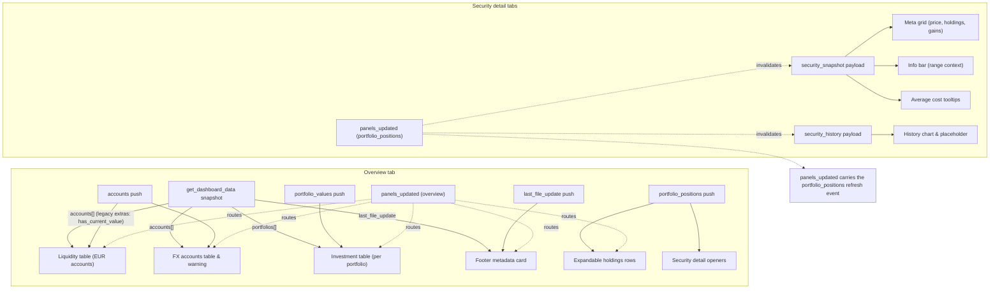

# Portfolio Performance Reader – Frontend Data Flow (Draft)

This draft consolidates how the Home Assistant dashboard renders backend payloads across all frontend tabs. The mermaid diagram summarises which websocket responses and events supply each UI surface, followed by tables outlining the rendered widgets, primary data, and notable behaviours.

## Overview tab surfaces

| UI surface | Consumed data | Key fields | Notes |
| --- | --- | --- | --- |
| Header card ("Übersicht") | `accounts[]` + `portfolio_values[]` push payloads (snapshot mirrors the same fields) | Accounts contribute `name`, `currency_code`, `balance`, `orig_balance`, `(fx_unavailable)`; portfolio entries supply `current_value`, `purchase_sum`, `position_count`, `missing_value_positions`, and `performance.*` (`gain_abs`, `gain_pct`, `total_change_eur`, `total_change_pct`, `source`, `coverage_ratio`). | `renderDashboard` totals the EUR balances and portfolio aggregates that arrive via push events; first paint still depends on `fetchDashboardDataWS`, whose snapshot currently includes the legacy extras until harmonisation is completed.【F:src/tabs/overview.ts†L1335-L1387】【F:src/tabs/overview.ts†L1406-L1451】【F:src/data/api.ts†L174-L199】 |
| Investment table | `portfolio_values.portfolios[]` push payload (snapshot keeps identical keys) | `uuid`, `name`, `current_value`, `purchase_sum`, `position_count`, `missing_value_positions`, and `performance.*` (`gain_abs`, `gain_pct`, `total_change_eur`, `total_change_pct`, `source`, `coverage_ratio`). | Portfolio aggregates are normalised into expandable table rows, with valuation and performance copied directly from the push payload; websocket responses still surface `has_current_value` until the backend trims it away.【F:src/tabs/overview.ts†L1357-L1397】【F:src/tabs/overview.ts†L1471-L1521】 |
| Expandable holdings rows | `portfolio_positions` push payload | `positions[].security_uuid`, `aggregation.*`, `performance.*`, `average_cost.*` | When a depot expands, the tab fetches positions and injects sortable rows, then wires security-detail launchers for each security UUID. The table reuses backend-provided performance values for consistency across tabs.【F:src/tabs/overview.ts†L1522-L1560】【F:src/tabs/overview.ts†L1561-L1613】【F:src/data/updateConfigsWS.ts†L188-L246】 |
| Liquidity table (EUR accounts) | `accounts[]` push payload | `name`, `currency_code`, `balance` | The renderer splits EUR accounts, renders balances in EUR, and contributes to the total wealth sum before display; the snapshot mirrors the same canonical fields on initial load.【F:src/tabs/overview.ts†L1335-L1392】【F:src/tabs/overview.ts†L1433-L1488】 |
| FX accounts table | `accounts[]` push payload | `name`, `currency_code`, `orig_balance`, `balance`, `(fx_unavailable)` | Non-EUR accounts render a two-column table with native and EUR balances and optional FX warning text when rates are missing; the snapshot bootstrap still includes the same fields plus `has_current_value` until backend alignment finishes.【F:src/tabs/overview.ts†L1433-L1488】 |
| Footer metadata card | `last_file_update` push payload | ISO 8601 timestamp string | The footer pulls the latest import timestamp and shows a fallback label when the fetch fails; the snapshot returns the identical string so first paint matches incremental updates.【F:src/tabs/overview.ts†L1399-L1425】 |
| Live updates queue | `panels_updated` (`accounts`, `portfolio_values`, `portfolio_positions`, `last_file_update`) | `data_type`, `data`, `portfolio_uuid` | `dashboard.ts` routes websocket events into update handlers that refresh the DOM sections without a full re-render. The documented schemas match the push payloads; `ws_get_dashboard_data` remains unchanged until backend work aligns the snapshot.【F:src/dashboard.ts†L1-L120】【F:src/dashboard.ts†L232-L311】 |

## Security detail tabs

| UI surface | Consumed data | Key fields | Notes |
| --- | --- | --- | --- |
| Header card & meta grid | `security_snapshot` | `snapshot.name`, `market_value_eur`, `total_holdings`, `performance.*`, `average_cost.*`, `last_price_*` | `renderSecurityDetail` fetches the snapshot, caches it, and renders an expanded meta grid with holdings, gains, and average cost tooltips derived from the payload. The header now shows `last_price.market_time` beside the price while the footer row highlights `last_price.fetched_at` freshness.【F:src/tabs/security_detail.ts†L1703-L1799】【F:src/tabs/security_detail.ts†L1189-L1299】 |
| Info bar & range controls | `security_snapshot`, `security_history` | `performance.day_change.*`, `currency_code`, `prices[]` | After loading the snapshot and history, the tab computes day changes for the active range and wires range buttons to refetch history windows on demand.【F:src/tabs/security_detail.ts†L1728-L1810】【F:src/tabs/security_detail.ts†L1430-L1544】【F:src/tabs/security_detail.ts†L1554-L1698】 |
| History chart placeholder | `security_history` | `prices[].date`, `prices[].close_native`, `prices[].close_eur` | The placeholder swaps to a rendered line chart once the requested range loads; empty/error states render informative copy before chart hydration.【F:src/tabs/security_detail.ts†L1728-L1810】【F:src/tabs/security_detail.ts†L1430-L1544】 |
| Cached snapshot notice | `security_snapshot` | `snapshot.source`, cached snapshot state | When a fetch fails, cached data triggers a banner explaining whether the view is stale or sourced from cache-only data.【F:src/tabs/security_detail.ts†L1709-L1740】 |
| Live update invalidation | `portfolio_positions` via `panels_updated` | `securityUuids[]` | Security detail tabs subscribe to `pp-reader:portfolio-positions-updated` events, invalidating cached snapshots and history when the current security changes in the background.【F:src/tabs/security_detail.ts†L300-L384】 |

## Shared behaviours

| Behaviour | Consumed data | Notes |
| --- | --- | --- |
| Initial data fetch | Websocket commands per payload group | The overview tab issues `fetchDashboardDataWS` before rendering, while detail views call the dedicated helpers in `src/data/api.ts`; both wait for fresh data prior to painting markup.【F:src/tabs/overview.ts†L1331-L1399】【F:src/tabs/security_detail.ts†L1710-L1770】【F:src/data/api.ts†L174-L205】 |
| Lazy loading & caching | `portfolio_positions`, `security_snapshot`, `security_history` | Expandable portfolios and security tabs cache data locally, reusing previous responses until a live update invalidates the caches for the relevant portfolio or security.【F:src/tabs/overview.ts†L1490-L1560】【F:src/data/positionsCache.ts†L1-L120】【F:src/tabs/security_detail.ts†L300-L384】 |
| Range selection | `security_history` | Range buttons call `fetchSecurityHistoryWS` with pre-defined windows, update the info bar, and refresh the chart in place without leaving the tab.【F:src/tabs/security_detail.ts†L1554-L1698】 |
