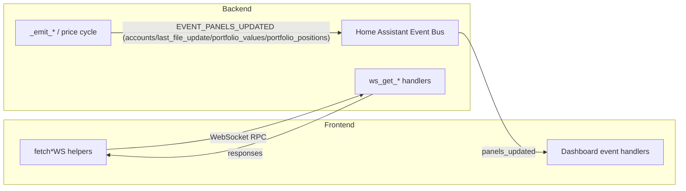

# Panel connector matrix

The table below links every dashboard websocket command and push event to its initiator, handler, payload, and UI usage.

| Event type | Initiating function | Event name | Receiving/handling function | Data contained | Distribution of the data in the frontend |
| --- | --- | --- | --- | --- | --- |
| Websocket call | `fetchDashboardDataWS()` | `pp_reader/get_dashboard_data` | `ws_get_dashboard_data()` | Responds with `accounts[]`, `portfolios[]`, `last_file_update`, and `transactions`; account entries carry `name`, `currency_code`, `orig_balance`, `balance`, and optional `fx_unavailable`, while portfolio entries expose `uuid`, `name`, `current_value`, `purchase_sum`, and `position_count`. | Legacy bootstrap snapshot used by earlier dashboard implementations to hydrate the same account and portfolio views that the granular loaders now refresh individually. |
| Websocket call | `fetchAccountsWS()` | `pp_reader/get_accounts` | `ws_get_accounts()` | Returns `accounts[]` entries containing `name`, `currency_code`, `orig_balance`, `balance`, and optional `fx_unavailable`. | `renderDashboard()` normalises each account, renders the EUR and FX tables, and contributes to the total wealth calculation and FX warning banner. |
| Websocket call | `fetchLastFileUpdateWS()` | `pp_reader/get_last_file_update` | `ws_get_last_file_update()` | Resolves `last_file_update` into a formatted timestamp string. | `renderDashboard()` places the timestamp in the footer card, while `handleLastFileUpdate()` keeps `.last-file-update` elements in the header/footer in sync. |
| Websocket call | `fetchPortfoliosWS()` | `pp_reader/get_portfolio_data` | `ws_get_portfolio_data()` | Returns `portfolios[]` rows with `uuid`, `name`, `current_value`, `purchase_sum`, `position_count`, and `performance` metadata. | `renderDashboard()` maps the payload into expandable portfolio rows, populating summary metrics and FX fallbacks for the overview table. |
| Websocket call | `fetchPortfolioPositionsWS()` | `pp_reader/get_portfolio_positions` | `ws_get_portfolio_positions()` | Replies with `{portfolio_uuid, positions[], error?}` where each position carries `security_uuid`, `name`, `current_holdings`, `purchase_value`, `current_value`, `average_cost`, `performance`, and `aggregation`. | Lazy loads position tables on expansion; rendered rows power per-security detail links, cached data, and sortable columns. |
| Websocket call | `fetchSecuritySnapshotWS()` | `pp_reader/get_security_snapshot` | `ws_get_security_snapshot()` | Provides `{security_uuid, snapshot}` with holdings totals, EUR valuations, last/close prices, aggregation breakdown, average-cost, performance metrics, and `source`. | `renderSecurityDetail()` builds the security header, meta section, info bar, and valuation breakdown from the snapshot (including cache/fallback notices). |
| Websocket call | `fetchSecurityHistoryWS()` | `pp_reader/get_security_history` | `ws_get_security_history()` | Returns `{security_uuid, prices[]}` with each point exposing `date`, `close`, and optional `close_raw`, alongside `start_date`/`end_date` echoes. | The security detail tab fetches the selected range, normalises the series, and feeds the chart plus day-change statistics. |
| Push event | `_emit_account_updates()` | `accounts` | `handleAccountUpdate()` | Emits `accounts[]` entries with `name`, `currency_code`, `orig_balance`, `balance`, and `fx_unavailable` flags. | Updates the EUR and FX account tables, recalculates totals, and refreshes the overall wealth figure used in the header card. |
| Push event | `_emit_last_file_update()` | `last_file_update` | `handleLastFileUpdate()` | Sends the formatted ISO timestamp string for the last portfolio file import. | Writes the status into `.last-file-update` nodes in both footer and header/meta sections. |
| Push event | `_emit_portfolio_updates()` `_run_price_cycle()` | `portfolio_values` | `handlePortfolioUpdate()` | Delivers portfolio aggregates containing `uuid`, `name`, `current_value`, `purchase_sum`, `position_count`, `performance`, and `missing_value_positions`. | Patches the expandable portfolio table cells, refreshes gain/percentage badges, and recalculates footer totals plus the wealth headline. |
| Push event | `_emit_portfolio_updates()` `_run_price_cycle()` | `portfolio_positions` | `handlePortfolioPositionsUpdate()` | Supplies per-portfolio payloads with `portfolio_uuid`, `positions[]`, and optional `error`; each position mirrors the websocket structure (`security_uuid`, `name`, `current_holdings`, `purchase_value`, `current_value`, `average_cost`, `performance`, `aggregation`). | Applies live deltas to expanded position tables, updates the cached dataset, and dispatches `pp-reader:portfolio-positions-updated` so other tabs (e.g. security detail) can react. |

