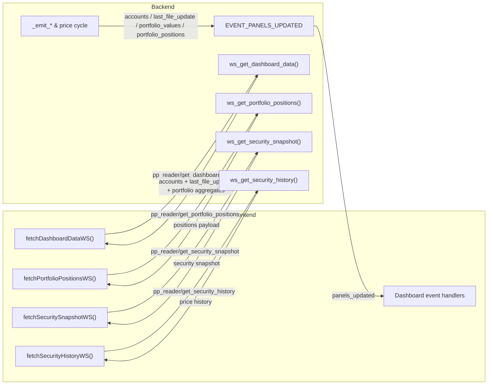

# Panel connector matrix

The table below links every dashboard websocket command and push event to its initiator, handler, payload, and UI usage.

| Event type | Initiating function | Event name | Receiving/handling function | Data contained | Distribution of the data in the frontend |
| --- | --- | --- | --- | --- | --- |
| Websocket call | `fetchDashboardDataWS()` | `pp_reader/get_dashboard_data` | `ws_get_dashboard_data()` | Returns an overview snapshot containing `accounts[]`, `portfolios[]`, `last_file_update`, and `transactions[]`. Account entries surface `name`, `currency_code`, `orig_balance`, `balance`, and the optional `fx_unavailable` flag; portfolio entries expose `uuid`, `name`, `current_value`, `purchase_sum`, `position_count`, `missing_value_positions`, and `performance.gain_abs`, `performance.gain_pct`, `performance.total_change_eur`, `performance.total_change_pct`, `performance.source`, `performance.coverage_ratio`. Snapshot harmonisation keeps the implementation unchanged for now, so websocket consumers still see the existing extras such as `has_current_value` whenever the backend provides them. | `renderDashboard()` consumes the snapshot for first paint, wiring the account tables, timestamp footer, wealth headline, and overview portfolio table in one roundtrip. |
| Websocket call | `fetchPortfolioPositionsWS()` | `pp_reader/get_portfolio_positions` | `ws_get_portfolio_positions()` | Returns `{portfolio_uuid, positions[], error?}`; each position supplies `security_uuid`, `name`, `current_holdings`, `purchase_value`, `current_value`, `average_cost.native`, `average_cost.security`, `average_cost.account`, `average_cost.eur`, `average_cost.source`, `average_cost.coverage_ratio`, `performance.gain_abs`, `performance.gain_pct`, `performance.total_change_eur`, `performance.total_change_pct`, `performance.source`, `performance.coverage_ratio`, `performance.day_change.price_change_native`, `performance.day_change.price_change_eur`, `performance.day_change.change_pct`, `performance.day_change.source`, `performance.day_change.coverage_ratio`, `aggregation.total_holdings`, `aggregation.positive_holdings`, `aggregation.purchase_value_cents`, `aggregation.purchase_value_eur`, `aggregation.security_currency_total`, `aggregation.account_currency_total`, `aggregation.purchase_total_security`, `aggregation.purchase_total_account`, plus optional mirrors `gain_abs`/`gain_pct`. | Lazy loads position tables on expansion; rendered rows power per-security detail links, cached data, sortable columns, and downstream `pp-reader:portfolio-positions-updated` consumers. |
| Websocket call | `fetchSecuritySnapshotWS()` | `pp_reader/get_security_snapshot` | `ws_get_security_snapshot()` | Provides `{security_uuid, snapshot}` with holdings totals, EUR valuations, last/close prices, aggregation breakdown, average-cost, performance metrics, and `source`. | `renderSecurityDetail()` builds the security header, meta section, info bar, and valuation breakdown from the snapshot (including cache/fallback notices). |
| Websocket call | `fetchSecurityHistoryWS()` | `pp_reader/get_security_history` | `ws_get_security_history()` | Returns `{security_uuid, prices[]}` with each point exposing `date`, `close`, and optional `close_raw`, alongside `start_date`/`end_date` echoes. | The security detail tab fetches the selected range, normalises the series, and feeds the chart plus day-change statistics. |
| Push event | `_emit_account_updates()` | `accounts` | `handleAccountUpdate()` | Emits `accounts[]` entries with `name`, `currency_code`, `orig_balance`, `balance`, and the optional `fx_unavailable` flag (present only when FX data is missing). | Updates the EUR and FX account tables, recalculates totals, and refreshes the overall wealth figure used in the header card. |
| Push event | `_emit_last_file_update()` | `last_file_update` | `handleLastFileUpdate()` | Sends the formatted ISO timestamp string for the last portfolio file import. | Writes the status into `.last-file-update` nodes in both footer and header/meta sections. |
| Push event | `_emit_portfolio_updates()` `_run_price_cycle()` | `portfolio_values` | `handlePortfolioUpdate()` | Delivers portfolio aggregates as `portfolios[]`, each containing `uuid`, `name`, `current_value`, `purchase_sum`, `position_count`, `missing_value_positions`, and `performance` with `gain_abs`, `gain_pct`, `total_change_eur`, `total_change_pct`, `source`, `coverage_ratio`; payloads may also carry `error`. | Patches the expandable portfolio table cells, refreshes gain/percentage badges, and recalculates footer totals plus the wealth headline. |
| Push event | `_emit_portfolio_updates()` `_run_price_cycle()` | `portfolio_positions` | `handlePortfolioPositionsUpdate()` | Supplies per-portfolio payloads with `portfolio_uuid`, `positions[]`, and optional `error`. Every position surfaces `security_uuid`, `name`, `current_holdings`, `purchase_value`, `current_value`, `average_cost` (`native`, `security`, `account`, `eur`, `source`, `coverage_ratio`), `performance` (`gain_abs`, `gain_pct`, `total_change_eur`, `total_change_pct`, `source`, `coverage_ratio`), and `aggregation` (`total_holdings`, `positive_holdings`, `purchase_value_cents`, `purchase_value_eur`, `security_currency_total`, `account_currency_total`, `purchase_total_security`, `purchase_total_account`). | Applies live deltas to expanded position tables, updates the cached dataset, and dispatches `pp-reader:portfolio-positions-updated` so other tabs (e.g. security detail) can react. |

