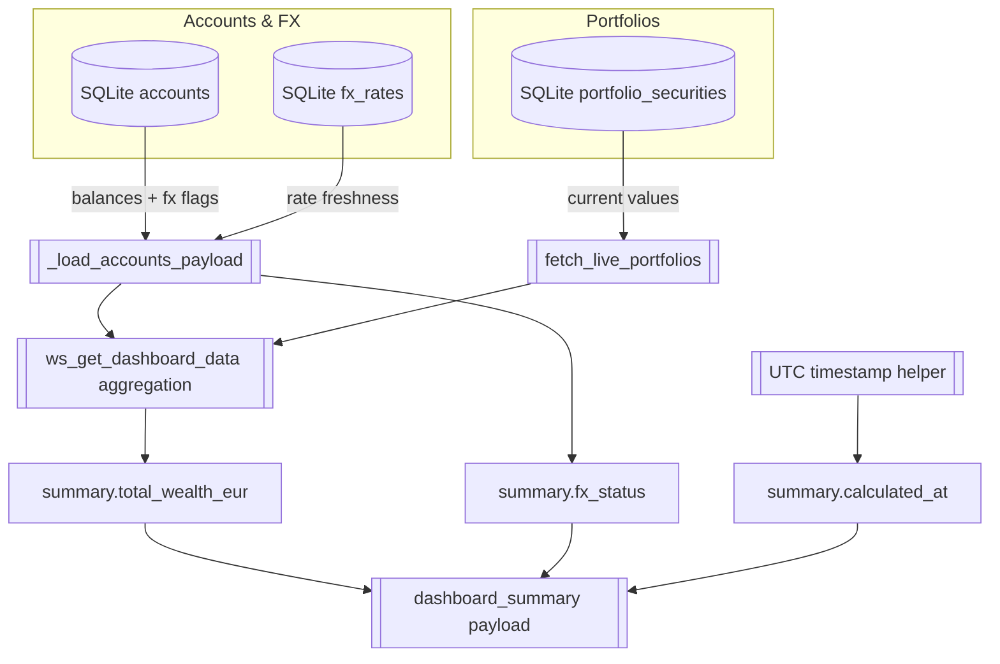
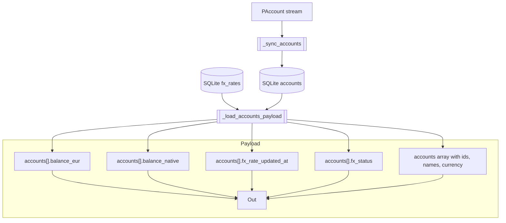
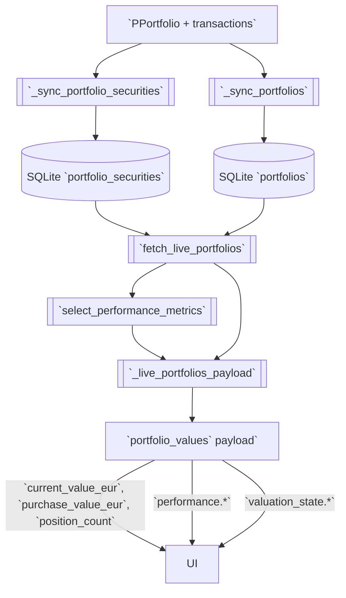
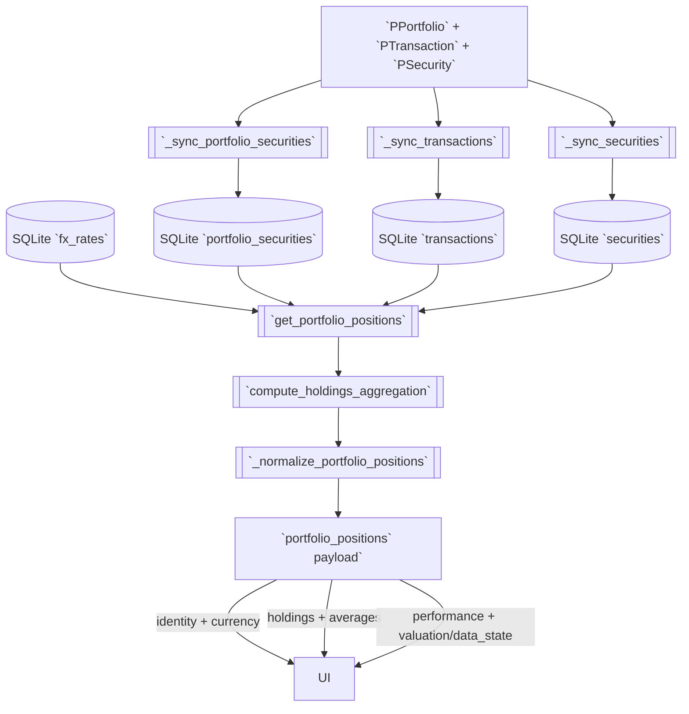
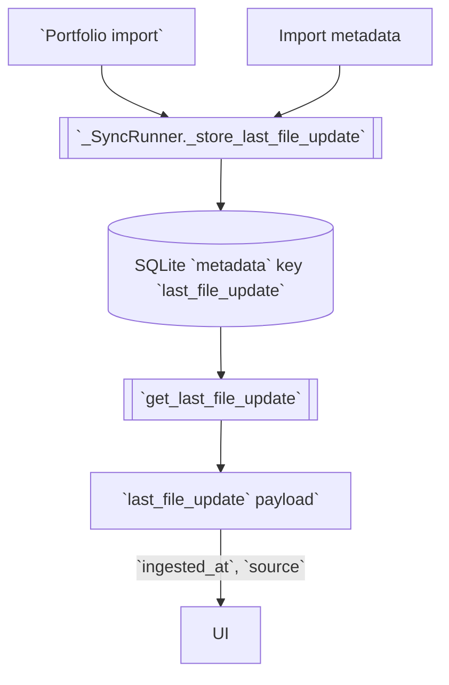
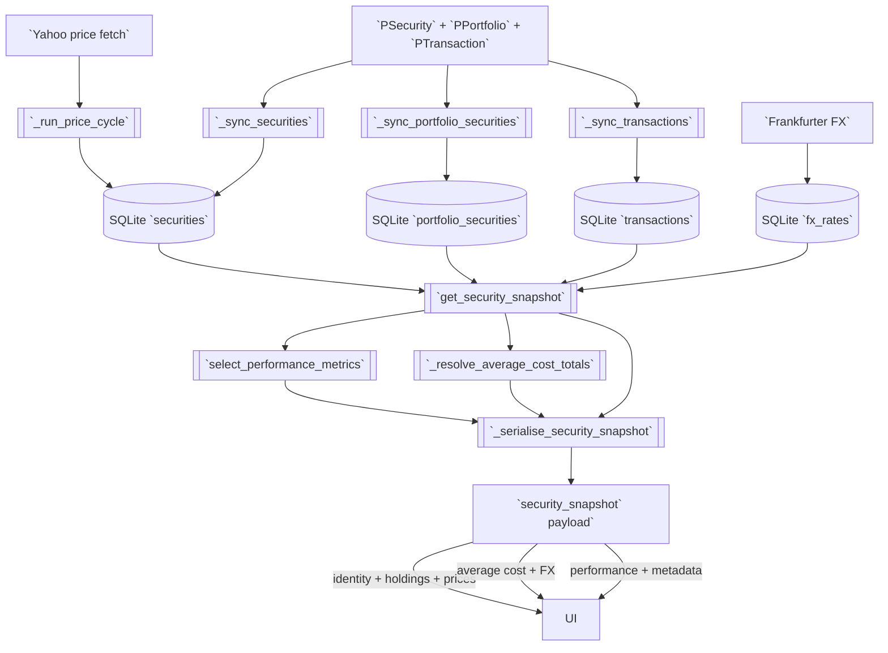
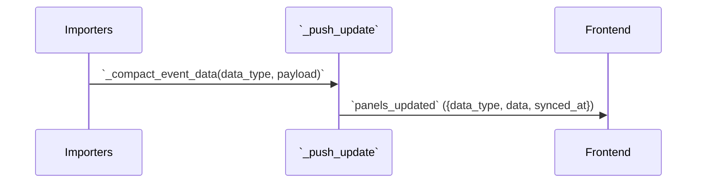

# Portfolio Performance Reader – Future Data Model Visualizations

### Dashboard summary (`pp_reader/get_dashboard_summary` command, `dashboard_summary` push)

**Scope**
- Provides the pre-aggregated wealth headline so the dashboard can render totals without client recomputation.
- Conveys FX coverage for banner logic, requiring fast inspection of account-level FX status.
- Guarantees a fresh `summary.calculated_at` stamp per payload emission for downstream caching.

**Mermaid visualization**


**Data contract table**
| Field / Subgroup | Source category | Notes / follow-up |
| --- | --- | --- |
| Summary totals (`summary.total_wealth_eur`) | 6 – Calculate it from database values in a function or method and hand it over directly to the front end. | Follow-up: `ws_get_dashboard_data` only emits accounts/portfolios without a summary block, so we still need to sum the live SQLite aggregates from `_load_accounts_payload` and `fetch_live_portfolios` before responding. |
| FX coverage (`summary.fx_status`) | 6 – Calculate it from database values in a function or method and hand it over directly to the front end. | Follow-up: the same websocket handler currently returns no FX status, so we must derive it at send time by inspecting the per-account FX availability flags produced in `_load_accounts_payload`. |
| Metadata (`summary.calculated_at`) | 6 – Calculate it from database values in a function or method and hand it over directly to the front end. | Follow-up: we still need to stamp the summary payload with `datetime.now()` (UTC) when assembling the websocket result, because the existing handler forwards only the account/portfolio data without a produced-at timestamp. |

**Implementation cues**
- Extend `custom_components/pp_reader/data/websocket.py::ws_get_dashboard_data` to consolidate `_load_accounts_payload` and `fetch_live_portfolios` outputs, emit the enum-mapped FX status, and stamp `datetime.now(tz=UTC)`.
- Ensure `custom_components/pp_reader/data/db_access.py::fetch_live_portfolios` continues supplying EUR totals so aggregation avoids per-request recomputation.
- Cache the composed summary within the websocket request scope only; no long-lived cache is required because the payload depends on current FX and holdings state.

### Account summaries (`pp_reader/get_accounts` command, `accounts` push)

**Scope**
- Delivers the canonical list of accounts for liquidity tables, preserving proto ordering and identifiers.
- Supplies pre-converted EUR balances so overview totals can recompute instantly on the client.
- Surfaces FX metadata for tooltip coverage with minimal websocket latency.

**Mermaid visualization**


**Data contract table**
| Field / Subgroup | Source category | Notes / follow-up |
| --- | --- | --- |
| Account identity (`accounts`, `accounts[].account_id`, `accounts[].name`, `accounts[].currency_code`) | 1 – Passed from portfolio file and stored in database. | No outstanding follow-ups; ensure proto ordering is preserved. |
| Balances (`accounts[].balance_native`, `accounts[].balance_eur`) | `balance_native`: 1 – Passed from portfolio file and stored in database. `balance_eur`: 6 – Calculate it from database values in a function or method and hand it over directly to the front end. | Portfolio exports do not carry an account balance field, and `_sync_accounts` currently recomputes `accounts.balance` via `db_calc_account_balance`; need follow-up to align the data source with this documentation. |
| FX metadata (`accounts[].fx_rate_updated_at`, `accounts[].fx_status`) | `fx_rate_updated_at`: 3 – Frankfurt, APIFX fetch store and database. `fx_status`: 6 – Calculate it from database values in a function or method and hand it over directly to the front end. | `fx_rate_updated_at`: `_load_accounts_payload` preloads today’s FX but we still need to surface that stored date as `fx_rate_updated_at`. `fx_status`: Follow-up: the websocket layer only emits the boolean `fx_unavailable` flag when a rate is missing, so we still need to map that status into the documented enum before responding. |

**Implementation cues**
- Keep `custom_components/pp_reader/data/db_access.py::get_accounts` and `_load_accounts_payload` responsible for joining `fx_rates` so websocket calls avoid per-row FX lookups.
- Update `custom_components/pp_reader/data/websocket.py::_load_accounts_payload` to emit the enum status and expose the stored Frankfurter timestamp.
- When aligning `accounts[].balance_native`, audit `db_calc_account_balance` to ensure the stored cent totals match the documented data source path.

### Portfolio summaries (`pp_reader/get_portfolios` command, `portfolio_values` push)

**Scope**
- Provides pre-aggregated portfolio metrics for the overview table without requiring client aggregation.
- Propagates performance calculations that depend on holdings, purchase totals, and FX normalization.
- Exposes valuation health so the UI can warn about missing data before drill-down.

**Mermaid visualization**


**Data contract table**
| Field / Subgroup | Source category | Notes / follow-up |
| --- | --- | --- |
| Portfolio identity (`portfolios`, `portfolios[].portfolio_id`, `portfolios[].name`) | 1 – Passed from portfolio file and stored in database. | No outstanding follow-ups; ensure ordering preserved. |
| Aggregated holdings (`portfolios[].position_count`, `portfolios[].purchase_value_eur`, `portfolios[].current_value_eur`) | `position_count`: 4 – Calculate and stored inside the database. `purchase_value_eur`: 4 – Calculate and stored inside the database. `current_value_eur`: 6 – Calculate it from database values in a function or method and hand it over directly to the front end. | No additional follow-ups beyond existing aggregation flows. |
| Performance metrics (`portfolios[].performance.gain_eur`, `portfolios[].performance.gain_pct`) | 6 – Calculate it from database values in a function or method and hand it over directly to the front end. | No outstanding follow-ups; maintain linkage with `select_performance_metrics`. |
| Valuation state (`portfolios[].valuation_state.status`, `portfolios[].valuation_state.missing_positions`) | 6 – Calculate it from database values in a function or method and hand it over directly to the front end. | Follow-up: the portfolio query only exposes `missing_value_positions`/`has_current_value`, so we still need to map those flags into the documented enum before the websocket responds. |

**Implementation cues**
- Extend `custom_components/pp_reader/data/websocket.py::_live_portfolios_payload` to translate `has_current_value`/`missing_value_positions` into the `valuation_state.status` enum and forward `missing_positions` verbatim.
- Ensure `custom_components/pp_reader/data/db_access.py::fetch_live_portfolios` continues returning cent-level aggregates for efficient conversion.
- Keep `custom_components/pp_reader/data/performance.py::select_performance_metrics` as the single performance calculator to avoid duplicated gain logic in the websocket layer.

### Portfolio positions (`pp_reader/get_portfolio_positions` command, `portfolio_positions` push)

**Scope**
- Supplies the per-portfolio holdings table with precomputed valuations, performance, and FX-aware averages.
- Preserves proto identifiers to support stable diffing across live updates.
- Surfaces valuation and data-state flags so row-level warnings can be rendered immediately.

**Mermaid visualization**


**Data contract table**
| Field / Subgroup | Source category | Notes / follow-up |
| --- | --- | --- |
| Container & routing (`portfolio_id`, `positions`) | `portfolio_id`: 1 – Passed from portfolio file and stored in database. `positions`: 1 – Passed from portfolio file and stored in database. | The `positions` array reuses `get_portfolio_positions` ordering for websocket diffing. |
| Position identity (`positions[].position_id`, `positions[].portfolio_id`, `positions[].security_id`, `positions[].name`, `positions[].security_currency_code`) | `positions[].portfolio_id`, `positions[].security_id`, `positions[].name`, `positions[].security_currency_code`: 1 – Passed from portfolio file and stored in database. `positions[].position_id`: 4 – Calculate and stored inside the database. | Follow-up: `get_portfolio_positions` still emits rows keyed by `security_uuid` without generating a separate `position_id`, so we need a follow-up to persist and expose a dedicated identifier. Follow-up: `get_portfolio_positions` never selects or returns the stored security currency yet, so we need a follow-up to forward the stored currency with each position. |
| Holdings & valuations (`positions[].quantity`, `positions[].current_value_eur`, `positions[].purchase_value_eur`) | `positions[].quantity`: 4 – Calculate and stored inside the database. `positions[].current_value_eur`: 6 – Calculate it from database values in a function or method and hand it over directly to the front end. `positions[].purchase_value_eur`: 4 – Calculate and stored inside the database. | Ensure cent-level aggregates remain in SQLite for efficient websocket normalization. |
| Average cost & FX (`positions[].average_cost.*`, `positions[].average_cost.fx_rate_timestamp`) | `average_cost.primary.value`: 4 – Calculate and stored inside the database. `average_cost.primary.currency`: 1 – Passed from portfolio file and stored in database. `average_cost.secondary.value`: 6 – Calculate it from database values in a function or method and hand it over directly to the front end. `average_cost.secondary.currency`: 6 – Calculate it from database values in a function or method and hand it over directly to the front end. `average_cost.fx_rate_timestamp`: 3 – Frankfurt, APIFX fetch store and database. | Follow-up: `AverageCostSelection`/`get_portfolio_positions` only emit numeric slots with no currency tag today, so we should extend the average_cost payload to include the stored code. Follow-up: the positions query and serializer emit only the numeric `AverageCostSelection` fields (including `eur`) without a currency tag, so we still need to label the secondary slot as `"EUR"` before responding. Portfolio purchase aggregation `db_calculate_sec_purchase_value` gathers FX requirements, invokes `ensure_exchange_rates_for_dates_sync`, and `_determine_exchange_rate` pulls rates via `load_latest_rates_sync` from `fx_rates`; add a follow-up to persist that rate date on the `AverageCostSelection` payload for this timestamp. |
| Performance & state (`positions[].performance.gain_eur`, `positions[].performance.gain_pct`, `positions[].valuation_state.*`, `positions[].data_state.*`) | 6 – Calculate it from database values in a function or method and hand it over directly to the front end. | Follow-up: the positions payload assembled in `get_portfolio_positions`/`_normalize_portfolio_positions` lacks any valuation keys today, so we still need to derive and attach the enum before responding. Follow-up: `get_portfolio_positions` and `_normalize_portfolio_positions` only return holdings, pricing, and performance fields today, so we still need to derive valuation flags and attach the explanatory reason when building the websocket payload. Follow-up: `ws_get_portfolio_positions` still returns a top-level `error` string on missing portfolios or loader failures, so we need to map those outcomes into per-position `data_state.status` values before emitting the payload. Follow-up: the websocket handler only surfaces failure text via the response-level `error` field today, so the normalization step must copy that string into each position’s `data_state.message` when `status` is `error`. |

**Implementation cues**
- Extend `custom_components/pp_reader/data/db_access.py::get_portfolio_positions` to persist `position_id`, expose the security currency code, and surface FX timestamps pulled from `fx_rates` joins.
- Update `custom_components/pp_reader/data/websocket.py::_normalize_portfolio_positions` to translate loader errors into `data_state.*` and attach valuation enums and reasons.
- Keep `custom_components/pp_reader/data/aggregations.py::compute_holdings_aggregation` as the central place for cent-to-EUR conversions to avoid duplicate rounding logic.

### Last file update (`pp_reader/get_last_file_update` command, `last_file_update` push)

**Scope**
- Communicates when the backend last processed a portfolio import for footer messaging.
- Provides provenance for the import source to support future multi-source scenarios.
- Offers a lightweight heartbeat payload that can be polled or pushed without heavy computation.

**Mermaid visualization**


**Data contract table**
| Field / Subgroup | Source category | Notes / follow-up |
| --- | --- | --- |
| Timestamps (`last_file_update.ingested_at`) | 4 – Calculate and stored inside the database. | No outstanding follow-ups; ensure truncated ISO persists. |
| Provenance (`last_file_update.source`) | 1 – Passed from portfolio file and stored in database. | Metadata sync today only upserts the ISO timestamp into the two-column `metadata` table and the websocket handler formats that string, so we still need to extend the schema/command pipeline to persist and emit the source flag alongside it. |

**Implementation cues**
- Extend `custom_components/pp_reader/data/db_access.py::get_last_file_update` and the metadata schema to store and return the source string alongside the timestamp.
- Update `custom_components/pp_reader/data/websocket.py` handlers to forward the augmented metadata without additional processing.
- Ensure `_SyncRunner._store_last_file_update` writes both timestamp and source atomically to keep push/poll parity.

### Security snapshot (`pp_reader/get_security_snapshot` command, `security_snapshot` push)

**Scope**
- Aggregates holdings, pricing, performance, and FX context for a single security in one payload.
- Enables drill-down views to render without additional API calls by including purchase totals and metadata.
- Must reconcile live market inputs (Yahoo) with stored portfolio data consistently across refreshes.

**Mermaid visualization**


**Data contract table**
| Field / Subgroup | Source category | Notes / follow-up |
| --- | --- | --- |
| Identity & currencies (`security_id`, `name`, `currency_code`, `account_currency_code`) | 1 – Passed from portfolio file and stored in database. | No outstanding follow-ups; ensure routing uses stored UUIDs. |
| Snapshot metadata (`snapshot_timestamp`, `data_source`, `last_transaction_at`) | `snapshot_timestamp`: 4 – Calculate and stored inside the database. `data_source`: 6 – Calculate it from database values in a function or method and hand it over directly to the front end. `last_transaction_at`: 4 – Calculate and stored inside the database. | `snapshot_timestamp`: we need a follow-up to persist the snapshot instant (e.g. reuse `metadata.last_file_update`) and expose it with the payload. `data_source`: `get_security_snapshot` and `_serialise_security_snapshot` currently emit only pricing, aggregation, and performance keys, leaving `data_source` unset, so we still need follow-up logic to tag snapshots as live/cache/historic before sending them. `last_transaction_at`: we need a follow-up to compute and persist the latest transaction timestamp before emitting the snapshot. |
| Holdings & valuation (`holdings.total_units`, `holdings.precise_units`, `market_value_eur`, `purchase_value_eur`) | `holdings.total_units`: 4 – Calculate and stored inside the database. `holdings.precise_units`: 4 – Calculate and stored inside the database. `market_value_eur`: 6 – Calculate it from database values in a function or method and hand it over directly to the front end. `purchase_value_eur`: 4 – Calculate and stored inside the database. | `holdings.precise_units`: `get_security_snapshot` only returns the rounded `total_holdings`, so we still need to surface the raw `portfolio_securities.current_holdings` (stored in 10⁻⁸ units per `data/db_schema.py`) as a dedicated precise value. |
| Pricing (`last_price.native_value`, `last_price.account_value`, `last_price.fetched_at`) | `native_value`: 2 – Yahoo query life fetch store in database. `account_value`: 6 – Calculate it from database values in a function or method and hand it over directly to the front end. `fetched_at`: 2 – Yahoo query life fetch store in database. | Follow-up: `get_security_snapshot` already converts the stored cent quote to EUR via `normalize_price_to_eur_sync` and `_serialise_security_snapshot` emits it as `last_price_eur`, but we still need to surface that figure under the documented `last_price.account_value` key. |
| Average cost (`average_cost.primary.*`, `average_cost.secondary.*`, `average_cost.fx_rate_timestamp`) | `primary.value`: 4 – Calculate and stored inside the database. `primary.currency`: 1 – Passed from portfolio file and stored in database. `secondary.value`: 6 – Calculate it from database values in a function or method and hand it over directly to the front end. `secondary.currency`: 6 – Calculate it from database values in a function or method and hand it over directly to the front end. `fx_rate_timestamp`: 3 – Frankfurt, APIFX fetch store and database. | `average_cost.secondary.currency`: `AverageCostSelection` only exposes numeric fields (`native`, `security`, `account`, `eur`) and `_serialise_security_snapshot` emits that mapping unchanged, so we still need to add an explicit `"EUR"` currency string alongside the secondary value before the frontend can display it. `average_cost.fx_rate_timestamp`: `get_security_snapshot` reads the aggregated purchase metrics produced by `db_calculate_sec_purchase_value`, so once that flow’s Frankfurter fetch (`ensure_exchange_rates_for_dates_sync` + `load_latest_rates_sync` on `fx_rates`) exposes its rate date we can emit it with the snapshot averages. |
| Performance (`performance.total.*`, `performance.day_change.*`) | `performance.total.*`: 6 – Calculate it from database values in a function or method and hand it over directly to the front end. `performance.day_change.value_native`: 2 – Yahoo query life fetch store in database. `performance.day_change.value_eur`, `performance.day_change.pct`, `performance.day_change.coverage_ratio`, `performance.day_change.source`: 6 – Calculate it from database values in a function or method and hand it over directly to the front end. | `performance.day_change.value_native`: we still need the Yahoo history ingest to persist the sampled `regularMarketPreviousClose` into `historical_prices`. |
| Purchase context (`purchase_totals.*`, `purchase_fx.*`) | `purchase_totals.security_currency`: 4 – Calculate and stored inside the database. `purchase_totals.account_currency`: 6 – Calculate it from database values in a function or method and hand it over directly to the front end. `purchase_fx.*`: 3 – Frankfurt, APIFX fetch store and database. | `purchase_totals.account_currency`: `get_security_snapshot` feeds `_resolve_average_cost_totals` and attaches its `purchase_total_account` to the aggregation map, and `_serialise_security_snapshot` rounds that value so the payload exposes the backend-converted EUR total. `purchase_fx.rate`: `custom_components/pp_reader/logic/securities.py::db_calculate_sec_purchase_value` gathers non-EUR transaction dates and calls `ensure_exchange_rates_for_dates_sync`; the Frankfurter client (`currencies/fx.py::_fetch_exchange_rates`) hits `https://api.frankfurter.app/{date}?from=EUR&to={symbols}` and `_save_rates_sync` upserts into the SQLite `fx_rates (date, currency, rate)` table declared in `data/db_schema.py`, then `_determine_exchange_rate` reloads the stored number via `load_latest_rates_sync`, so we just need to expose that persisted value on the snapshot serializer. `purchase_fx.currency_pair`: Because `_fetch_exchange_rates` always requests `from=EUR`, `_save_rates_sync` records each term currency under `fx_rates.currency`, letting the serializer label the stored rate as `EUR/{tx.currency_code}` once the metadata is forwarded with the snapshot payload. `purchase_fx.as_of`: `ensure_exchange_rates_for_dates_sync` iterates every transaction timestamp, formats it via `dt.strftime("%Y-%m-%d")`, and `_save_rates_sync` keeps that string as the `fx_rates.date` primary key, so wiring the saved metadata into the snapshot will surface the persisted rate date. |

**Implementation cues**
- Expand `custom_components/pp_reader/data/db_access.py::get_security_snapshot` to load transaction-derived timestamps, Frankfurter rate metadata, and Yahoo history prerequisites before serialization.
- Update `custom_components/pp_reader/data/websocket.py::_serialise_security_snapshot` to rename existing EUR price outputs to the documented keys and attach the `data_source` classification.
- Coordinate the Yahoo ingest addition in `custom_components/pp_reader/prices/price_service.py::_run_price_cycle` with history persistence so day-change metrics have consistent inputs.

### Security history (`pp_reader/get_security_history` command, `security_history` push)

**Scope**
- Streams chart-ready price series for each security across selectable ranges.
- Distinguishes between Portfolio Performance and market data to label the chart legend accurately.
- Ensures EUR overlays are delivered alongside native closes for consistent tooltip behaviour.

**Mermaid visualization**
```mermaid
flowchart TD
  ProtoPrices[Portfolio Performance prices] --> SyncHist[[sync_from_pclient]]
  Yahoo[Yahoo history ingest] --> HistDB[(SQLite historical_prices)]
  SyncHist --> HistDB
  FX[(FX normalization helpers)] --> History[[ws_get_security_history]]
  HistDB --> History
  History --> Range[range token mapping]
  History --> Series["prices[] entries"]
  Range --> Payload[security_history payload]
  Series --> Payload
  Payload --> Fields[series_source<br/>prices[].close_native<br/>prices[].close_eur]
  Fields --> UI
```

**Data contract table**
| Field / Subgroup | Source category | Notes / follow-up |
| --- | --- | --- |
| Identity & selection (`security_id`, `range`) | `security_id`: 1 – Passed from portfolio file and stored in database. `range`: 6 – Calculate it from database values in a function or method and hand it over directly to the front end. | `range`: translate websocket parameters into canonical tokens before responding. |
| Series metadata (`series_source`) | 6 – Calculate it from database values in a function or method and hand it over directly to the front end. | Portfolio imports write prices without tagging the origin, so once the Yahoo history ingest lands we must persist a source flag and map it to `portfolio_performance` vs `market_data`. |
| Price points (`prices`, `prices[].date`, `prices[].close_native`, `prices[].close_eur`) | `prices`, `prices[].date`, `prices[].close_native`: 2 – Yahoo query life fetch store in database. `prices[].close_eur`: 6 – Calculate it from database values in a function or method and hand it over directly to the front end. | Follow-ups: Yahoo pipeline must parse ISO datestamps, map `close` into `historical_prices.close`, and extend the history handler to call `normalize_price_to_eur_sync` per row before emitting EUR values. |

**Implementation cues**
- Add Yahoo history persistence in `custom_components/pp_reader/prices/price_service.py` so `historical_prices` holds both origin and close data for requested ranges.
- Update `custom_components/pp_reader/data/websocket.py::ws_get_security_history` to translate `start_date`/`end_date` parameters into canonical range tokens and attach EUR conversions.
- Ensure `custom_components/pp_reader/util/currency.py::normalize_price_to_eur_sync` can be reused efficiently for per-point conversions without redundant rate lookups.

### Live update envelope (`panels_updated` bus)

**Scope**
- Carries push notifications that instruct the frontend which handler should process the payload.
- Wraps underlying data model sections without altering their structure.
- Provides optional timestamps for debugging event freshness once implemented.

**Mermaid visualization**


**Data contract table**
| Field / Subgroup | Source category | Notes / follow-up |
| --- | --- | --- |
| Discriminator (`data_type`) | 6 – Calculate it from database values in a function or method and hand it over directly to the front end. | No follow-up; values already align with canonical literals. |
| Payload passthrough (`payload`) | 6 – Calculate it from database values in a function or method and hand it over directly to the front end. | `_compact_event_data` only removes redundant keys before `_push_update` nests the structure under `data`. |
| Emission timestamp (`synced_at`) | 6 – Calculate it from database values in a function or method and hand it over directly to the front end. | Follow-up: `_push_update` currently emits only `domain`, `entry_id`, `data_type`, and `data`, so we still need to add a timestamp (for example `dt_util.utcnow().isoformat()`) before the frontend can display `synced_at`. |

**Implementation cues**
- Extend `custom_components/pp_reader/data/event_push.py::_push_update` to append a UTC timestamp and ensure the structure remains `{"data_type", "data", "synced_at"}`.
- Keep `_compact_event_data` focused on removing redundant keys so downstream payloads remain identical to their source API responses.
- Audit all producers (`sync_from_pclient`, `price_service`) to confirm they pass canonical `data_type` strings that align with the documented enum.
