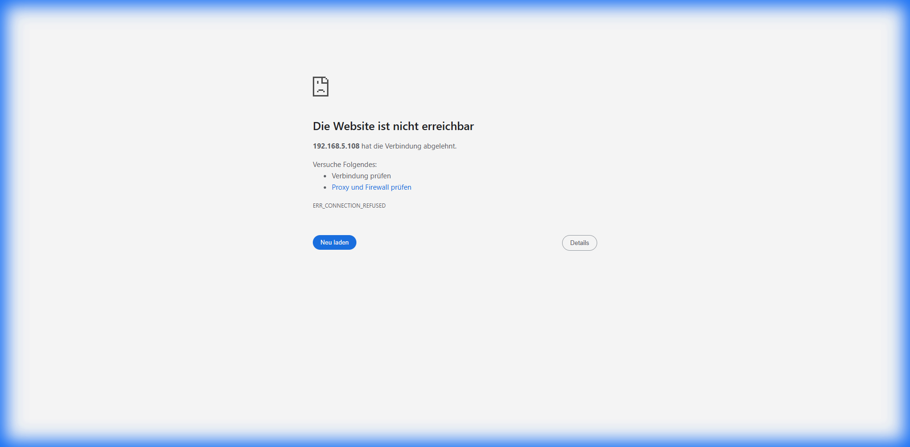
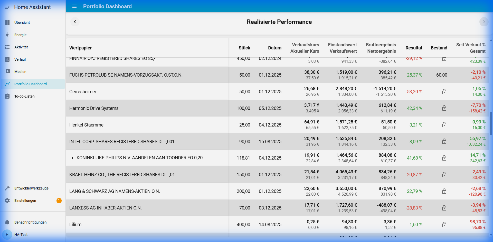
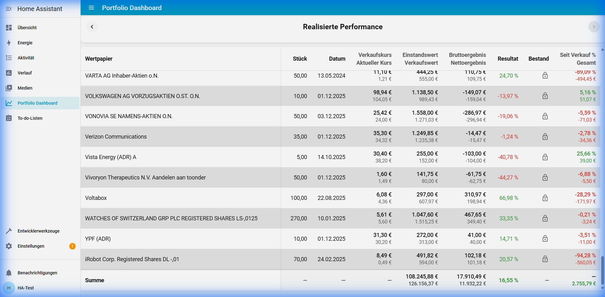

# Walkthrough - Stacked Trades Columns Feature

## Feature Verification
We implemented a stacked column layout for the "Trades" (Realisierte Performance) tab to save space and improve readability.

### 1. Stacked Layout
The following column pairs were combined:
- **Verkaufskurs** / **Aktueller Kurs**
- **Einstandswert** / **Verkaufswert**
- **Bruttoergebnis** / **Nettoergebnis**

**Verification Screenshot:**

(Note: Screenshots are stored in artifacts directory)

### 2. Granular Sorting
We verified that sorting works independently for top and bottom metrics in the stacked columns.

**Sorting by Gross Result (Bruttoergebnis):**

**Sorting by Net Result (Nettoergebnis):**

## Implementation Details
- Modified `src/tabs/trades.ts`:
  - Updated `renderTradesTable` to use stacked HTML structure.
  - Added `renderLots` support for stacked structure.
  - Implemented custom `sortTrades` function to handle stacked data sorting via `data-val` attributes.
  - Added CSS for `.sort-stack`, `.cell-stack`, and `.val-top` / `.val-bottom`.
- Verified build and linting passes.

## Bug Fix: Currency Mismatch in "Seit Verkauf"
Fixed a critical bug where "Seit Verkauf" (Since Sale) gain was calculated by subtracting EUR-denominated sale price from foreign-currency current price (e.g., JPY), leading to massive erroneous gains.

### Verification
**Before Fix (Bug):**
Current Price (JPY) - Sell Price (EUR) = Huge Number.

**After Fix (Correct):**
Current Price converted to EUR - Sell Price (EUR) = Correct Result.
Harmonic Drive Systems: ~ -158 EUR.

## Bug Fix: Date Sorting Logic in Trades Tab
Fixed an issue where "Datum" (last_sell_date) was not sorting correctly.

### Impact
Dates were sorted as numbers (parsing the year only, e.g. "2024") instead of full date strings, causing random ordering for dates within the same year.

### Resolution
- Updated sort logic in `src/tabs/trades.ts` to use strict `Number()` parsing vs greedy `parseFloat()`.
- ISO date strings now correctly fall back to string comparison (`localeCompare`), ensuring chronological order.

**Verification:**
- Verified with reproduction script showing correct chronological sort of ISO dates.
- Verified numeric columns still sort strictly numerically.

## Bug Fix: Missing "Summe" Row Values
Fixed an issue where the "Summe" (Total) row in the "Realisierte Performance" tab was missing values for key consolidated columns.

### Resolution
- Updated `src/content/elements.ts` to support explicit `footerValues` in table generation.
- Updated `src/tabs/trades.ts` to calculate and pass total values for:
  - **Einstandswert / Verkaufswert** (Sum)
  - **Bruttoergebnis / Nettoergebnis** (Sum)
  - **Resultat** (Weighted Percentage: Gross Result / Total Purchase)
  - **Seit Verkauf** (Sum of absolute values)

### Verification
**After Fix:**
Verified that the footer row is correctly populated.

